# Lab 1: Explore the Unified Lakehouse Foundation

## Introduction

Alex has an approved business ontology, but an ontology alone does not make source data trustworthy. The underlying records still arrive with different identifiers, formats, quality levels, and update schedules. In this lab, you will inspect the representative source feeds prepared for Seer Construction Group and follow them through a prebuilt Bronze, Silver, and Gold medallion architecture implemented inside ALH.

The workshop uses simulated extracts that emulate data from Fusion ERP, Primavera, CRM, and on-premises applications. OCI Object Storage and Oracle Autonomous AI Lakehouse are the real services used to store, organize, and query the workshop data.

AIDP could perform equivalent transformations with Spark notebooks and workflows. In this workshop, ALH is both the transformation environment and the serving layer. You will prove that boundary by using Data Studio to link an Object Storage CSV as a Bronze external table and then running a small Bronze-to-Silver SQL transformation directly in ALH.

**Estimated Time:** 25 minutes

### Objectives

In this lab, you will:

- Verify that the pre-provisioned workshop schemas and data are available.
- Create a Bronze external table over a CSV in OCI Object Storage using the Data Studio interface.
- Use Data Studio Catalog to inspect representative Bronze, Silver, and Gold entities.
- Run a representative Bronze-to-Silver transformation inside ALH.
- Explain what belongs in Bronze, Silver, and Gold.
- Trace a steel-delivery business event across multiple source extracts.
- Review data quality, reconciliation, and lineage evidence.

### Prerequisites

- Authenticated OCI Console access to the Autonomous AI Lakehouse
- The `object_storage_base_uri` value from the Terraform outputs
- Access to Database Actions and Data Studio
- Read access to `SEER_BRONZE`, `SEER_SILVER`, and `SEER_GOLD`
- A database resource principal with read access to the workshop Object Storage bucket
- Permission to create a table and view in the connected database schema

> **Note:** Use the `ADMIN` Database Actions session for this lab. The external table and Silver demonstration view are created in the `ADMIN` schema, and the screenshots reflect that session. The `SEER_WORKSHOP` user owns the embedding model and is used only where the workshop explicitly instructs you to sign in with that account.

## Task 1: Verify the workshop environment

The environment was built before the workshop. Begin with a short readiness check so later exercises fail early and clearly if a required asset is missing.

1. In the OCI Console, open the **Navigation menu**, select **Oracle AI Database**, and then select **Autonomous AI Database**.

2. Select the region and compartment assigned to your workshop environment, then filter the Autonomous AI Database list by that compartment. You can find both values in the LiveLabs **View Login Info** panel. Open the Autonomous AI Lakehouse instance.

    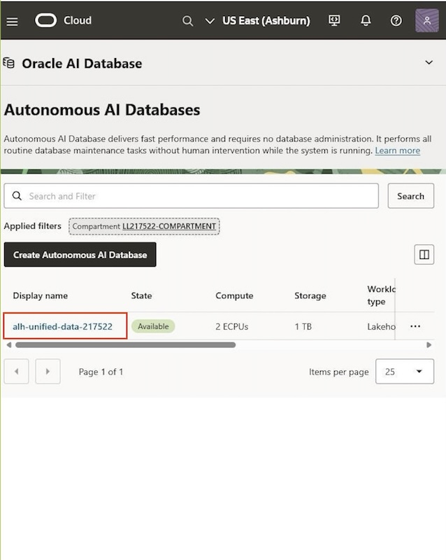

3. On the database details page, select **Database actions**, and then select **SQL**. SQL Worksheet opens in a new browser tab.

    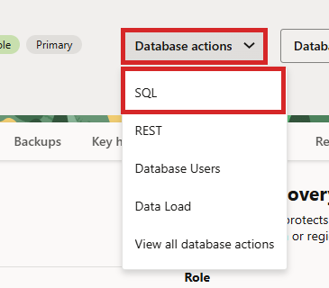

4. Wait for the SQL worksheet to finish loading. First-time users may see a short **Run Statement** tour, an ADMIN-user warning, a dark-theme announcement, or other informational notices. Select **X**, **Close**, or **Done** when those controls are available.

    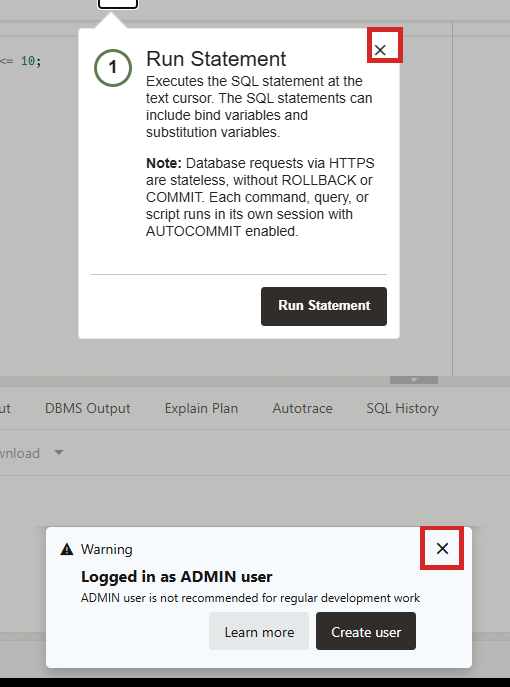

5. Run the following query to confirm your connected database user. Select **Run Statement** after pasting the query.

    ```sql
    <copy>
    SELECT USER AS connected_user FROM dual;
    </copy>
    ```

    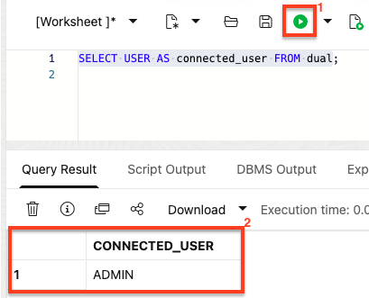

6. Run the following query to confirm that the three medallion schemas are visible:

    ```sql
    <copy>
    SELECT owner, COUNT(*) AS object_count
    FROM all_objects
    WHERE owner IN ('SEER_BRONZE', 'SEER_SILVER', 'SEER_GOLD')
      AND object_type IN ('TABLE', 'VIEW')
    GROUP BY owner
    ORDER BY owner;
    </copy>
    ```

    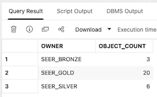

7. Run the following query to confirm that the workshop contains source data, conformed entities, consumer-ready Gold data sets, and document chunks:

    ```sql
    <copy>
    SELECT 'Bronze source records' AS asset, COUNT(*) AS row_count
    FROM seer_bronze.source_record_inventory
    UNION ALL
    SELECT 'Silver assets', COUNT(*)
    FROM seer_silver.assets
    UNION ALL
    SELECT 'Gold project context', COUNT(*)
    FROM seer_gold.project_context
    UNION ALL
    SELECT 'Searchable document chunks', COUNT(*)
    FROM seer_gold.document_chunks;
    </copy>
    ```

    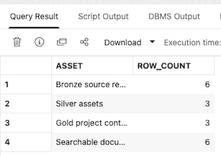

8. Verify that every result contains at least one row. If an object is missing, stop and use the **Need Help?** section before continuing.

## Task 2: Link an Object Storage CSV as a Bronze external table

The workshop setup uploaded representative source extracts to a private Object Storage bucket. In this task, you will use the Autonomous AI Database Data Studio interface to link one CSV without copying it into a managed database table. The resulting external table is the Bronze source for your hands-on transformation.

1. On the Database Actions Launchpad, select **Data Load** under **Data Studio**.

    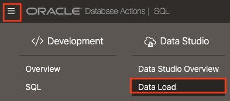

2. On the Data Load home page, select **Connections**.

    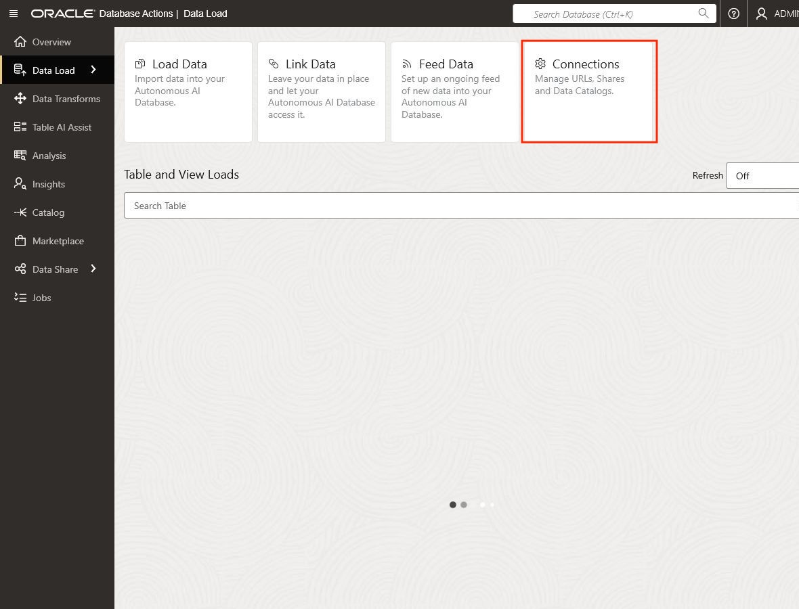

3. Select **Create**, and then select **New Cloud Store Location**.

    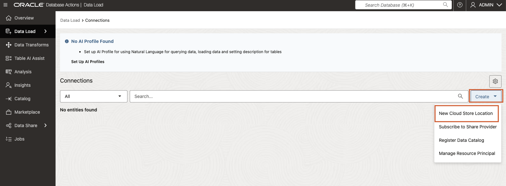

4. On **Storage Settings**, configure the cloud store location:

    - **Name:** 
    ```
    <copy>
    SEER_LAKE_SOURCE
    </copy>
    ```

    - **Description:** Private storage location for the workshop's sample source files used to create the Bronze external table.

    - **Select Credential:** Keep the preselected `OCI$RESOURCE_PRINCIPAL` credential for the connected user.
    ```
    <copy>
    OCI$RESOURCE_PRINCIPAL
    </copy>
    ```
    
    - **Bucket URI:** Copy **Bucket URI** from **View Login Info** on lab page. It should be under `object_storage_base_uri` value from the Terraform outputs, for example `https://objectstorage.us-ashburn-1.oraclecloud.com/n/<namespace>/b/<bucket-name>/o/`.

    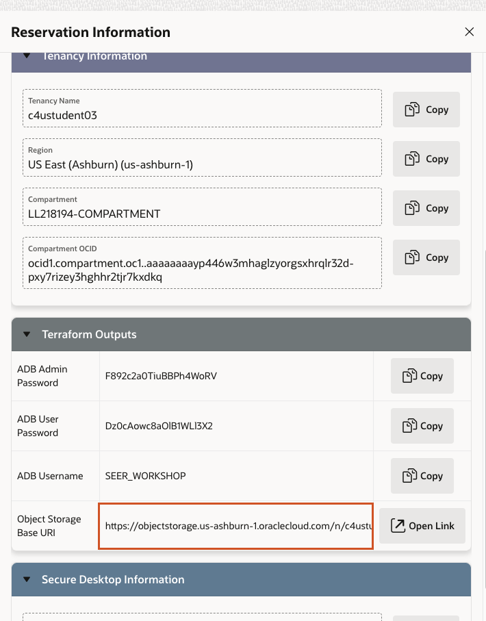
    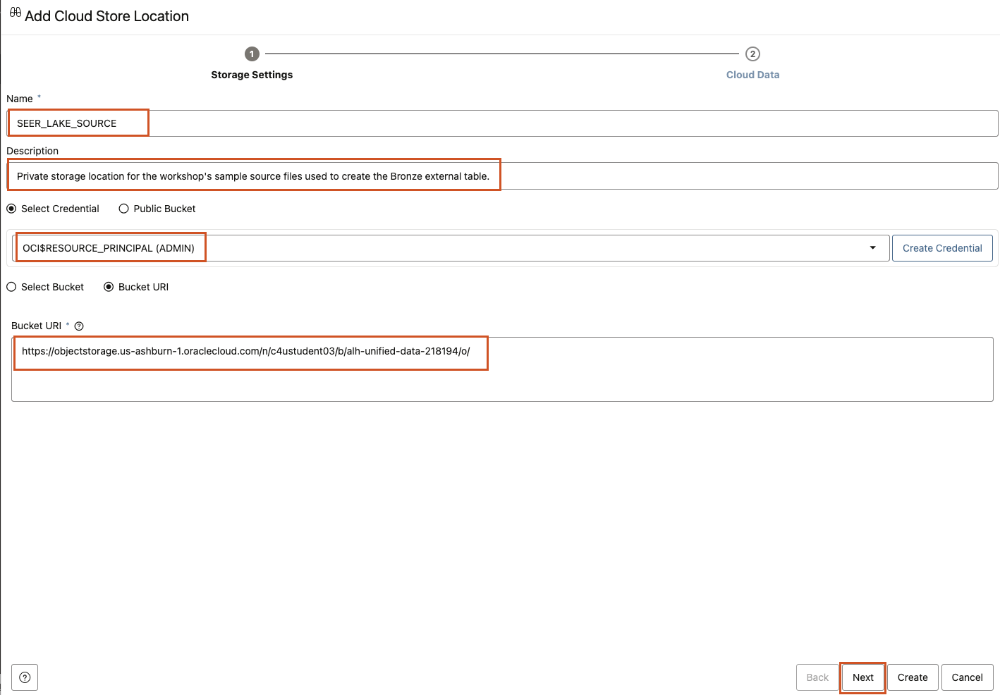

    The environment setup has already enabled the resource principal and granted it read access to this private bucket. You do not need an OCI username, auth token, or signing key.

5. Select **Next**. On **Cloud Data**, confirm that the preview lists folders such as `documents`, `models`, and `source-data`. This confirms that the database can reach the private bucket. Select **Create**.

    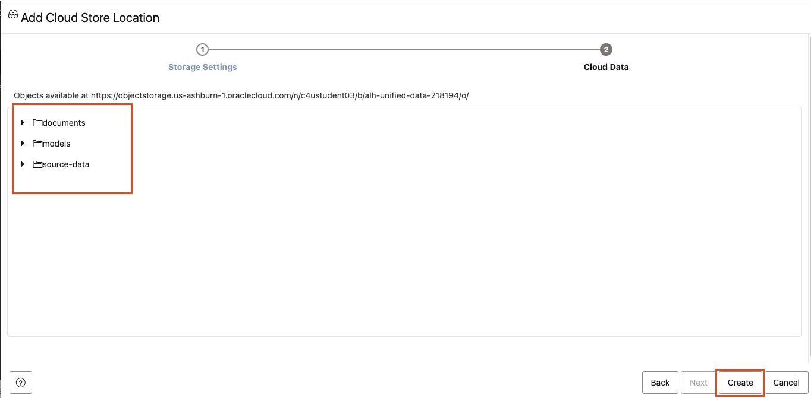

6. Select the **Data Load** breadcrumb to return to the Data Load home page, and then select **Link Data**. **Cloud Store** is selected by default.
    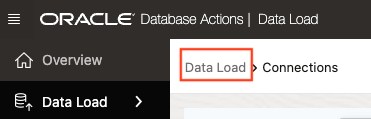
    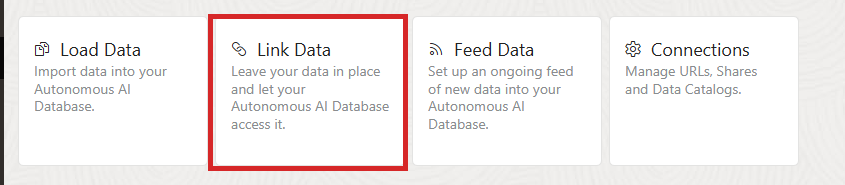

    > **Link rather than load:** **Link Data** leaves the CSV in Object Storage and creates an external table. **Load Data** would copy the rows into a managed database table.

7. Confirm that `SEER_LAKE_SOURCE` is selected. Expand `SEER_LAKE_SOURCE`, `source-data`, and `suppliers`. Double-click `supplier_extract.csv`, or drag it into the data link cart.

    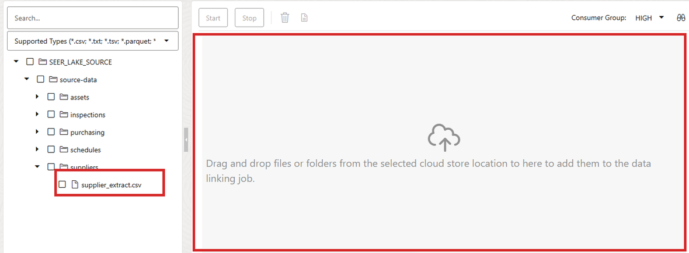

8. On the file card, select the **Settings** pencil icon to configure the link. You only need to update the **Table Name** and **Validation Type** fields. Confirm that all other settings match the screenshot below.

    * **Option:** Create External Table
    * **Table Name:** 
    ```
    <copy>
    SUPPLIER_TRANSFORM_EXT
    </copy>
    ```
    * **Validation Type:** Full
    * **Partition Column:** None
    * **Encoding:** AL32UTF8 — Unicode UTF-8 encoding scheme
    * **Text Enclosure:** Double quote (")
    * **Field Delimiter:** Comma
    * **Column Header Row:** Select this option and set the row to 1.
    * **Start Processing Data at Row:** 2 (set automatically when the header row is selected)

    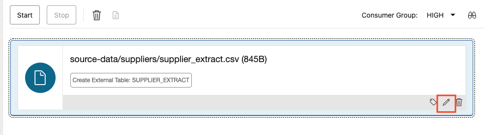
    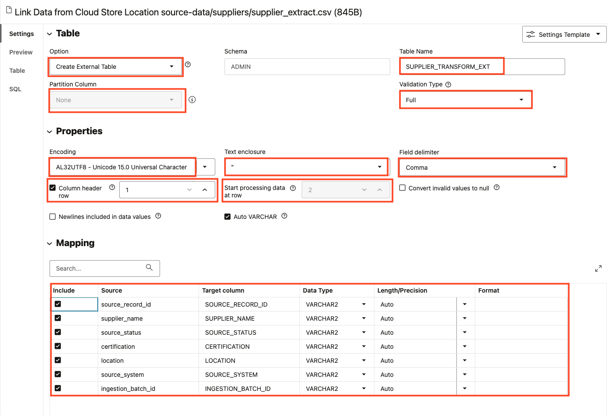

9. In **Mapping**, retain the source-aligned columns. This is a Bronze asset, so do not standardize names, statuses, certifications, or locations yet.

10. Confirm that Mapping contains the seven CSV columns: source record ID, supplier name, source status, certification, location, source system, and ingestion batch ID. Data Studio does not add separate file-name or link-timestamp mapping rows in this flow. Object Storage lineage, the cloud-store connection, and `INGESTION_BATCH_ID` preserve the source context needed for this exercise.

11. Review **File Preview** to confirm that the header and CSV fields were interpreted correctly.

    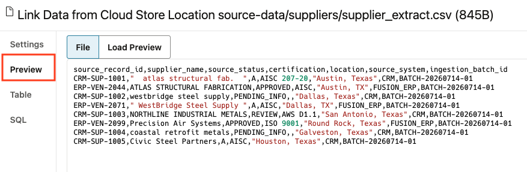

12. Open **SQL** in the left pane and review the database commands Data Studio will generate. Notice `DBMS_CLOUD.CREATE_EXTERNAL_TABLE`; you do not need to copy or run this SQL manually.

    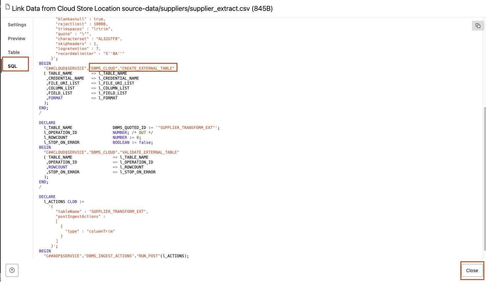

13. Select **Close**, and then select **Start** in the data link cart. In **Start Link From Cloud Store**, select **Run**.

    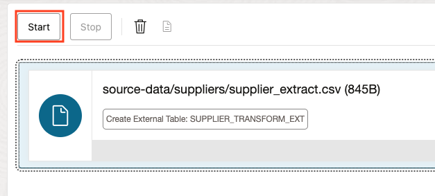

    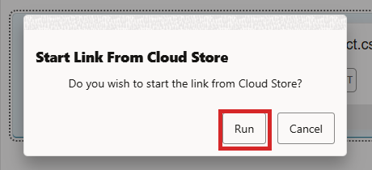

14. Wait for Data Studio to return to the Data Load home page. Confirm that `SUPPLIER_TRANSFORM_EXT` shows **8 rows loaded**.

    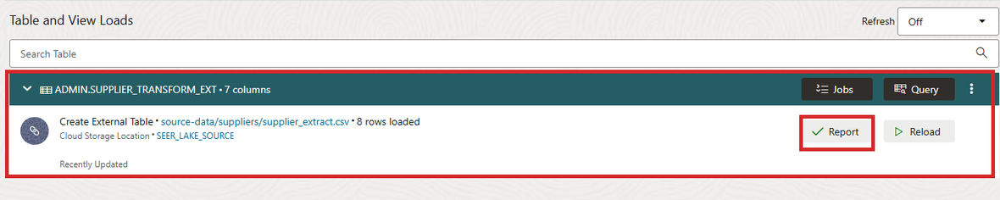

15. Select **Report**. Confirm that the Job Report shows **8 rows validated**, **8 rows processed successfully**, and **0 rows rejected**. Select **Close**.

    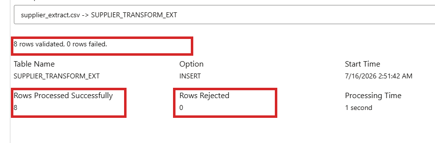

16. On the completed external-table card, select **Query**. Data Studio opens **Analysis** with a query for `SUPPLIER_TRANSFORM_EXT` already populated. Select **Run**, then confirm that the results show the seven external-table columns and eight rows. `SUPPLIER_TRANSFORM_EXT` contains the actual supplier records from the CSV you linked. This verifies that ALH can query that raw supplier file directly from Object Storage through a Bronze external table. If the **Selected Schema** tour prompt appears, select **X** to close it.

    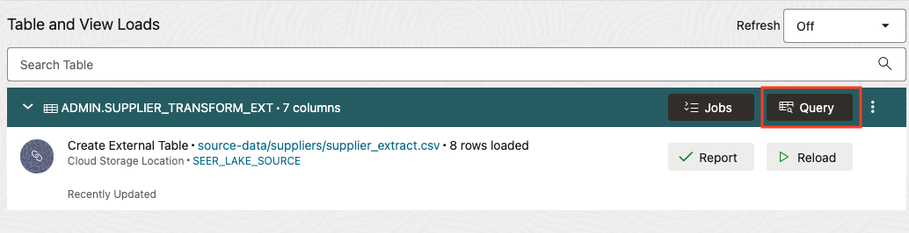

    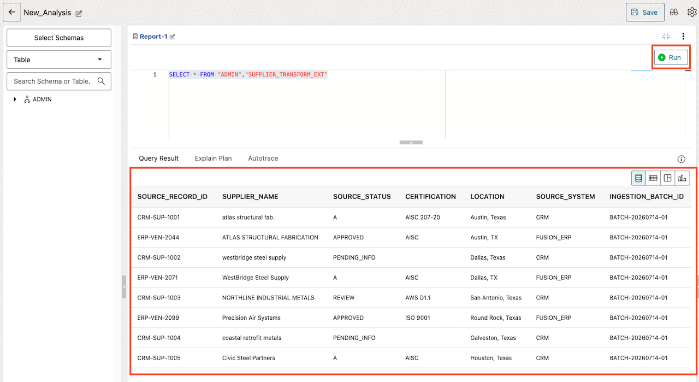

17. Return to the Database Actions Launchpad, select **SQL** under **Development** to open the SQL Worksheet, and review the broader seeded source inventory.

    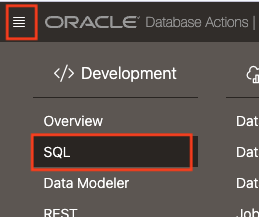

    The next query serves a different purpose. It does **not** read `SUPPLIER_TRANSFORM_EXT` or the eight supplier records. Instead, it reads `seer_bronze.source_record_inventory`, a separate workshop table that acts as an inventory of the staged source files. Each row describes a source file—for example, its originating system, file name, format, record count, extraction time, and ingestion batch. This places the one supplier-file example you just queried in the context of the wider Bronze layer. Paste the following read-only query, and select **Run**:

    ```sql
    <copy>
    SELECT source_system,
           source_object,
           storage_format,
           record_count,
           extracted_at,
           ingestion_batch_id
    FROM seer_bronze.source_record_inventory
    ORDER BY source_system, source_object;
    </copy>
    ```
    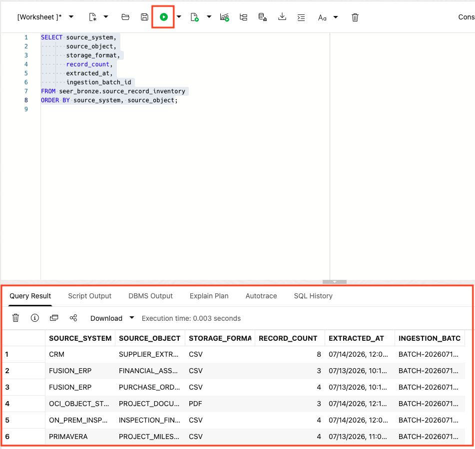

18. Review the results from `seer_bronze.source_record_inventory`. The supplier CSV linked as `SUPPLIER_TRANSFORM_EXT` is one example of a Bronze source. `Seer_bronze.source_record_inventory` provides the wider view of the representative source files staged in Object Storage, including Fusion ERP-style purchasing and financial data, Primavera-style milestones, on-premises inspection findings, and PDF project evidence. In business terms, it is the register of what data arrived and where it came from. Bronze preserves that raw data and its source context; it is not yet the standardized, stable dataset that downstream applications should consume
.

## Task 3: Compare Bronze, Silver, and Gold

The medallion layers answer different questions.

**Table 1. Bronze, Silver, and Gold: Purpose and Controls**

The medallion layers answer different questions about the same business domain. Bronze preserves incoming records as supplied, including their source context. Silver applies rules that determine when multiple records refer to the same real-world entity, then standardizes the resulting entity and summarizes its provenance. Gold packages those trusted entities into stable, consumer-ready datasets.
In this task, you will use the Catalog to inspect representative datasets in each layer and follow that progression from source context to conformed entities to business-ready data.


| Layer | Primary question | Typical controls |
| --- | --- | --- |
| Bronze | What arrived from the source? | Provenance, ingestion time, source format, raw-payload retention |
| Silver | What enterprise entity does it represent? | Standardization, validation, deduplication, reconciliation |
| Gold | What trusted, consumer-ready data set does a consumer need? | Business definitions, stable schema, quality and freshness expectations |

1. Right click the SQL worksheet tab and select **Duplicate** so you have two tabs. On the second tab, select **Catalog** under **Data Studio**

    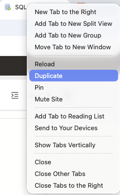
    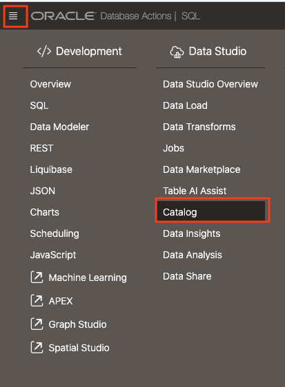

2. Confirm that **LOCAL** is the selected catalog. Open the schema selector, remove the current schema if needed, select `SEER_BRONZE`, and select **Apply**. Search for `SOURCE_RECORD_INVENTORY`.

    
    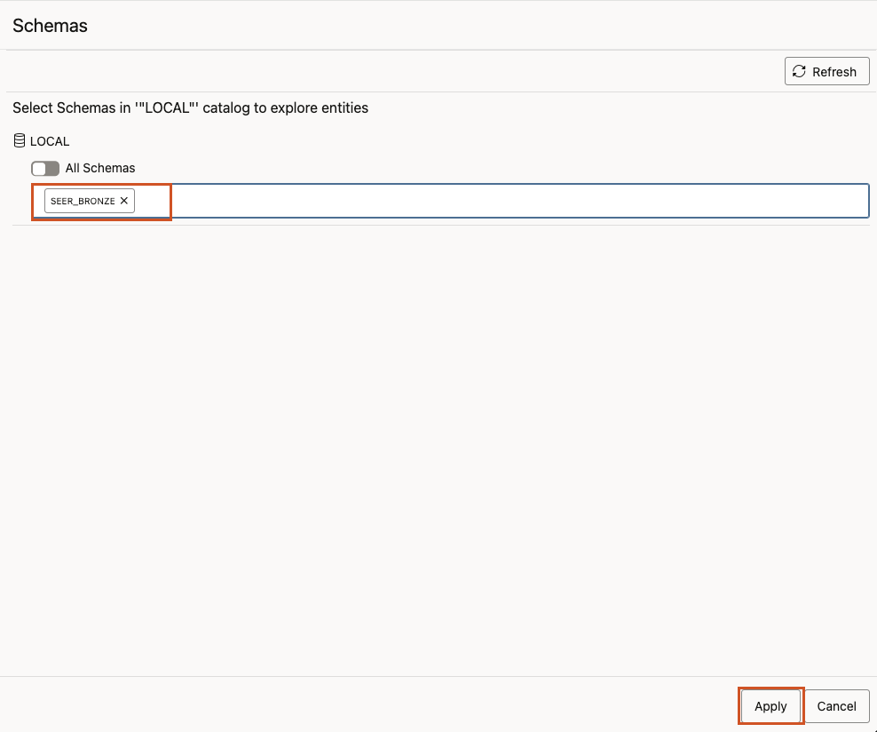

3. Open `SEER_BRONZE.SOURCE_RECORD_INVENTORY`. Use the entity-detail tabs to:

    * Select **Preview** to inspect the inventory rows.
    * Review the columns and data types.
    * Review statistics when available.
    * Locate the source object, storage format, extraction time, and ingestion-batch metadata.

    This table is an inventory of source data that arrived in the lakehouse. Each row identifies a source dataset, where it came from, its format, and the number of records it contains. It answers: **“What arrived, and where did it come from?”**
    Bronze preserves source context and traceability. It is intentionally close to the incoming data and is not yet the stable, standardized dataset that downstream consumers should use.

    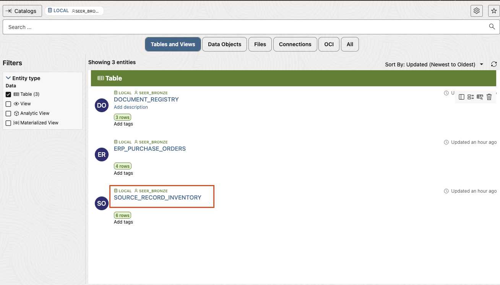
    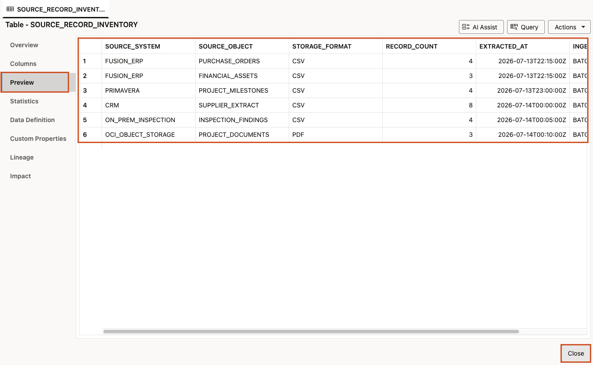

4. Select **Close** to return to the Catalog. In the schema selector, replace `SEER_BRONZE` with `SEER_SILVER`, then select Apply. Search for and open `ASSETS`, then select Preview. `SEER_SILVER.ASSETS` contains one conformed row for each business asset rather than one row for every incoming source record. Review these columns:

    * `ASSET_ID` — the standardized identifier for the asset.
    * `CANONICAL_ASSET_NAME` — the approved, consistent name used across the business.
    * `PROJECT_ID` — the associated project identifier.
    * `ASSET_TYPE` — the normalized asset category.
    * `NORMALIZED_STATUS` — the standardized lifecycle or operational status.
    * `SOURCE_SYSTEM_COUNT` — the number of source systems that contributed evidence for the asset.
    * `RECONCILIATION_STATUS` — the outcome of the matching and reconciliation process.

    Silver applies the “these records refer to the same asset” rules, then produces a standardized business entity. The canonical name, normalized status, source-system count, and reconciliation status are transformation outputs; they are not necessarily fields copied directly from a source CSV.

    
    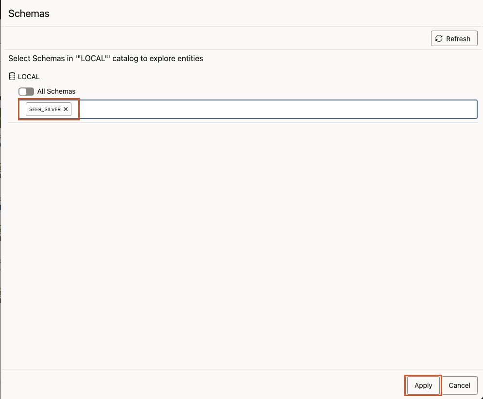
    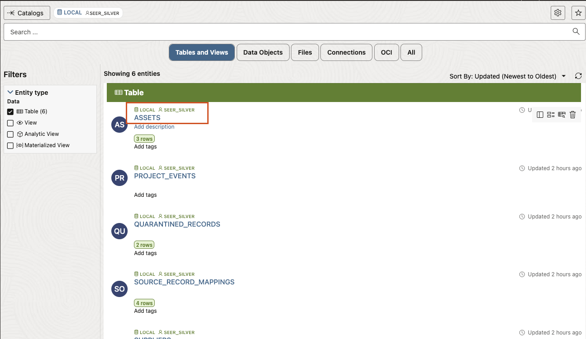
    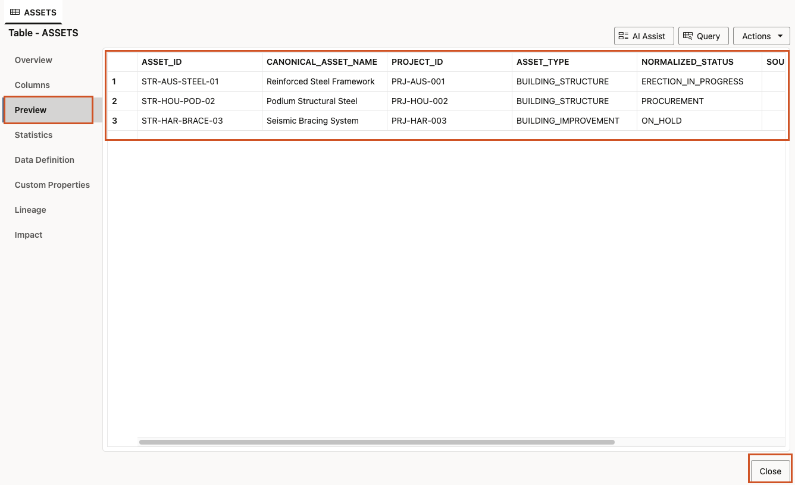

5. Select **Close** to return to the Catalog. Search for and open `SEER_SILVER.SUPPLIERS`, then select **Preview**. Review the standardized supplier names, qualification statuses, compliance statuses, and matched-source counts. This is another Silver example. The transformation resolves differing source representations into one conformed supplier entity that the business can use consistently:

    * `SUPPLIER_ID` identifies the standardized supplier.
    * `CANONICAL_SUPPLIER_NAME` provides a consistent business name.
    * `QUALIFICATION_STATUS` and `COMPLIANCE_STATUS` standardize business assessments.
    * `MATCHED_SOURCE_COUNT` indicates how many source records contributed to the conformed supplier.

    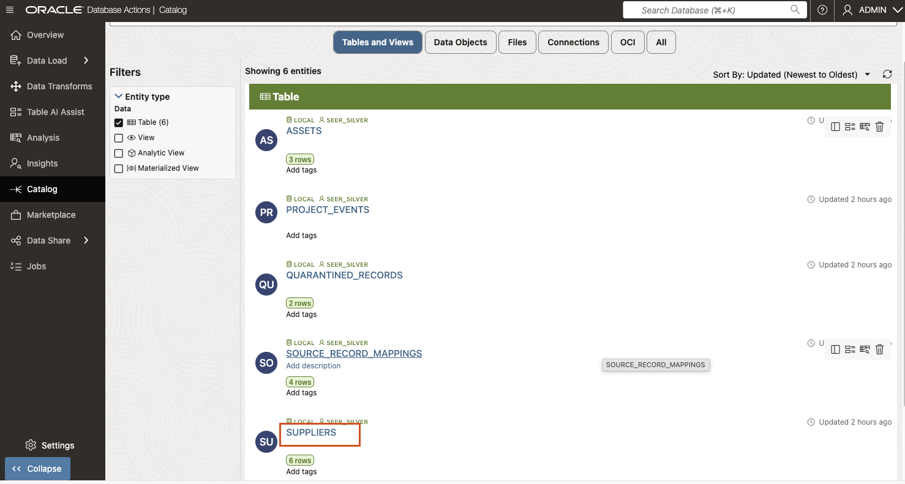
    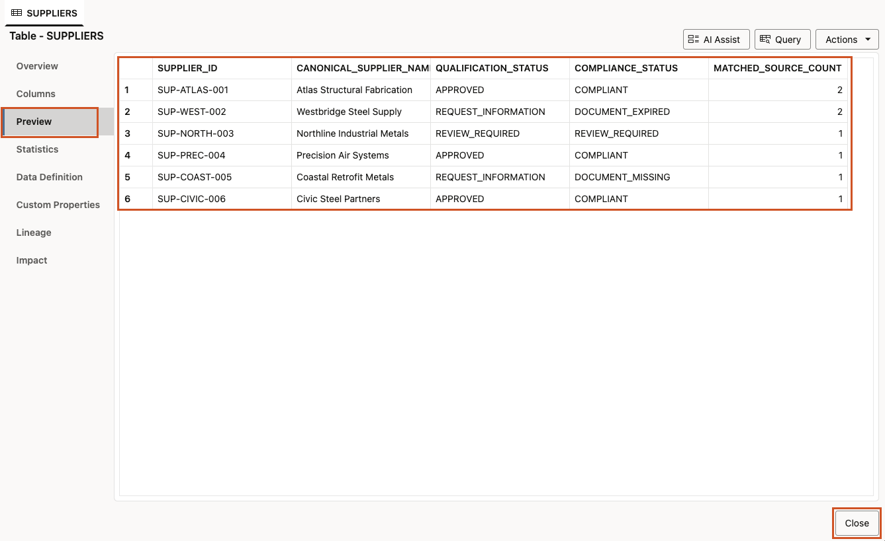

6. Select **Close** to return to the Catalog. In the schema selector, replace `SEER_SILVER` with `SEER_GOLD`, then select **Apply**. Search for and open `PROJECT_CONTEXT`, then select **Preview**. `SEER_GOLD.PROJECT_CONTEXT` is a consumer-ready data product that combines related, conformed information into one project-level view. Rather than requiring a consumer to separately find an asset, its project status, milestone, supplier information, inspections, and cost data, the Gold transformation assembles that context into a single record for each project. The dataset draws on standardized Silver-layer entities and curated operational records, using shared business identifiers—such as project and asset IDs—to relate them. It brings together fields such as:

    * project and asset identity;
    * the current project milestone;
    * committed cost;
    * inspection information;
    * supplier context; and
    * freshness or update information.

    Inspect the columns to see how the Gold layer presents this integrated business context in a stable, easy-to-consume format. Unlike Bronze, which preserves the incoming source shape, and Silver, which standardizes individual entities, Gold is organized around a consumer need: **“What is the current context for this project?”** Reports, applications, and AI experiences can use this table without having to interpret or join the underlying source-system data themselves.

    
    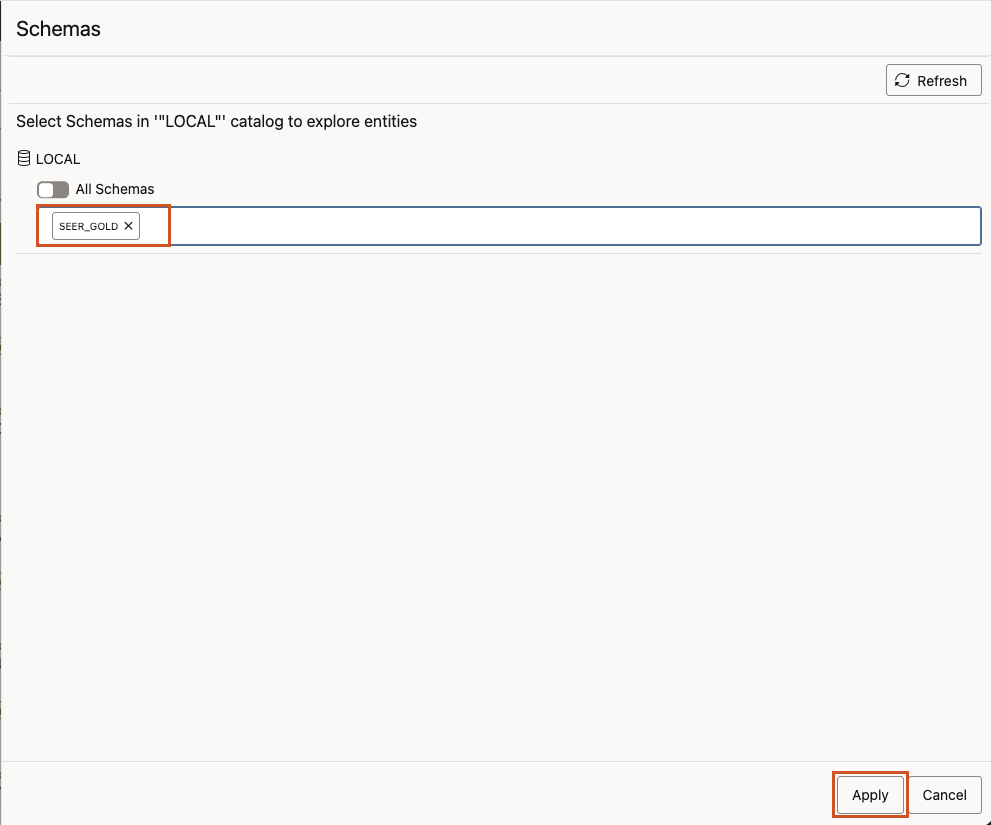
    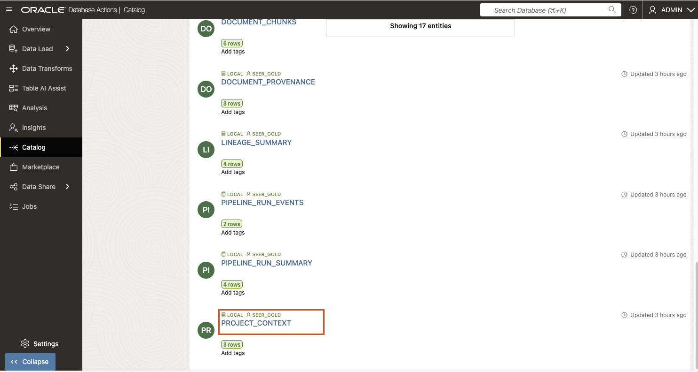
    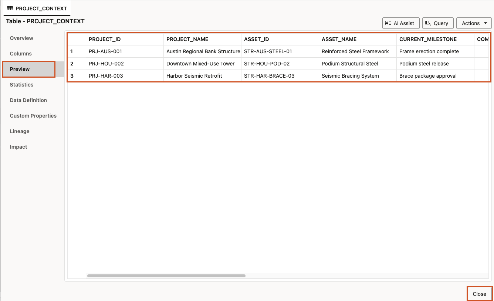

7. Compare the three layers:

    * **Bronze** preserves what arrived and where it came from. It retains source-shaped records and ingestion context.
    * **Silver** applies the “these records refer to the same asset or supplier” rules, standardizes names, types, and statuses, and summarizes provenance.
    * **Gold** provides stable, business-focused, consumer-ready datasets for reports, applications, and AI use cases.

    Provenance remains available throughout the lakehouse. However, Gold consumers no longer need to understand every source-system field or file format. In the next task, you will apply this pattern by transforming the Bronze supplier data linked earlier into a standardized Silver view using SQL in ALH.


## Task 4: Run a Bronze-to-Silver supplier transformation

In this task, you will write a SQL transformation that converts raw supplier records into a consistent Silver-style representation.
You will read from `SUPPLIER_TRANSFORM_EXT`, the external table created in Task 2. Because it is an external table, Oracle reads the linked CSV from Object Storage when you query it; this task does not copy the CSV into a new table.
The source records intentionally contain differences that commonly occur across systems:

* supplier-name abbreviations and inconsistent capitalization;
* different status codes for the same business meaning;
* missing or differently formatted certifications; and
* location values expressed in different formats.

You will create `SUPPLIER_STANDARDIZED_DEMO`, a view in your connected schema. A view stores the transformation logic, not a separate copy of the data: whenever you query it, Oracle reads the linked source and applies the standardization rules.

>**Before you begin:** Confirm that Task 2 created the external table named `SUPPLIER_TRANSFORM_EXT` in your connected schema. Use this table name consistently in every query below.
>**Important:** This exercise standardizes each source record. It does not yet merge multiple source rows into one supplier record. Production Silver pipelines can also perform entity matching, survivorship, validation, and quarantine processing.

1. Switch tab to the SQL Worksheet tab you had previously used. Run the following query:

    ```sql
    <copy>
    SELECT source_record_id,
           supplier_name,
           source_status,
           certification,
           location,
           source_system,
           ingestion_batch_id
    FROM supplier_transform_ext
    ORDER BY source_record_id;
    </copy>
    ```

    
    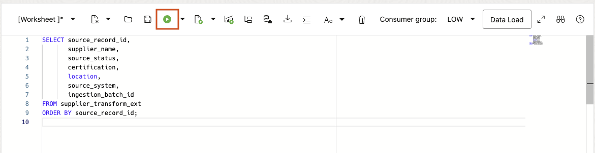

2. Review the eight returned records. Notice examples of source-specific variation, such as abbreviated supplier names, inconsistent capitalization, different status values, locations expressed as `Austin, Texas` or `Austin, TX`, and missing certifications. Bronze preserves these values as they arrived from the source systems. It does not alter them to make them consistent.

    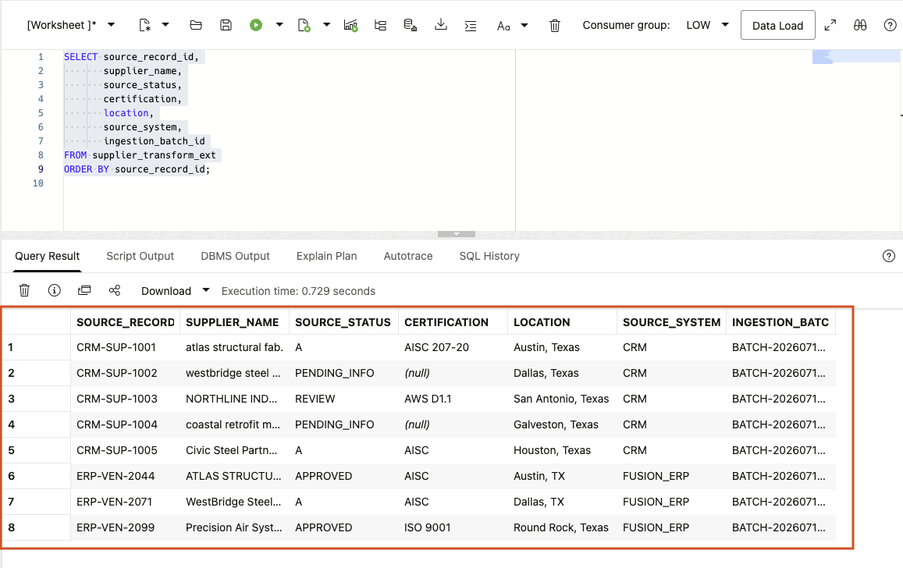

3. Run the following SQL:

    ```sql
    <copy>
    CREATE OR REPLACE VIEW supplier_standardized_demo AS
    SELECT source_record_id,
           CASE
             WHEN UPPER(TRIM(supplier_name)) IN (
                    'ATLAS STRUCTURAL FAB.',
                    'ATLAS STRUCTURAL FABRICATION'
                  )
             THEN 'Atlas Structural Fabrication'
             ELSE INITCAP(TRIM(supplier_name))
           END AS canonical_supplier_name,
           CASE UPPER(TRIM(source_status))
             WHEN 'A' THEN 'APPROVED'
             WHEN 'APPROVED' THEN 'APPROVED'
             WHEN 'PENDING_INFO' THEN 'REQUEST_INFORMATION'
             ELSE 'REVIEW_REQUIRED'
           END AS qualification_status,
           CASE
             WHEN certification IS NULL THEN 'MISSING'
             WHEN UPPER(certification) LIKE '%AISC%' THEN 'AISC'
             ELSE UPPER(TRIM(certification))
           END AS normalized_certification,
           REPLACE(
             UPPER(TRIM(location)),
             ', TEXAS',
             ', TX'
           ) AS normalized_location,
           source_system,
           ingestion_batch_id
    FROM supplier_transform_ext;
    </copy>
    ```
    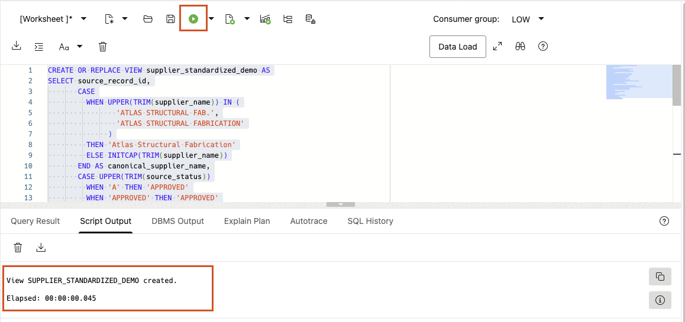

    This statement creates a view named `SUPPLIER_STANDARDIZED_DEMO`.
    The transformation:

    * maps known name variants to one `CANONICAL_SUPPLIER_NAME`
    * translates raw status values into a consistent `QUALIFICATION_STATUS`
    * standardizes certification values and identifies missing certifications
    * normalizes location text; and
    * retains the source-system and ingestion-batch fields for traceability

    The original linked CSV and the external table remain unchanged.

4. Run:

    ```sql
    <copy>
    SELECT *
    FROM supplier_standardized_demo
    ORDER BY canonical_supplier_name, source_record_id;
    </copy>
    ```
    Confirm that all eight source records are still present. The difference is that the displayed values are now standardized:

    * name variations resolve to a canonical supplier name
    * statuses use consistent business terms
    * certifications use a common format or show `MISSING`
    * locations use a consistent format.

    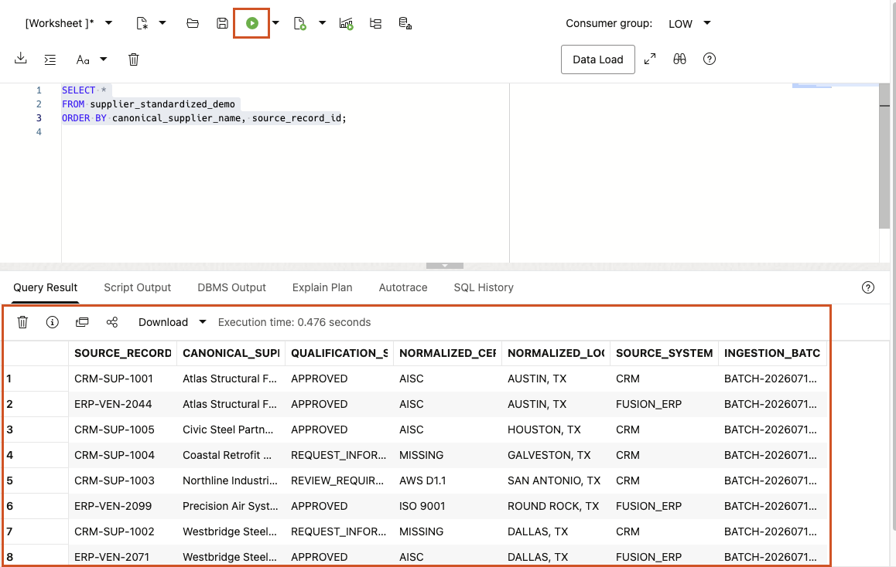

5. The workshop includes `SEER_SILVER.SUPPLIER_SOURCE_MAPPINGS`, which contains the expected standardized values for each source record. Run:

    ```sql
    <copy>
    SELECT demo.source_record_id,
           demo.canonical_supplier_name AS attendee_result,
           silver.canonical_supplier_name AS seeded_silver_result,
           CASE
             WHEN demo.canonical_supplier_name = silver.canonical_supplier_name
              AND demo.qualification_status = silver.qualification_status
              AND demo.normalized_certification = silver.normalized_certification
              AND demo.normalized_location = silver.normalized_location
             THEN 'MATCH'
             ELSE 'REVIEW'
           END AS validation_status
    FROM supplier_standardized_demo demo
    JOIN seer_silver.supplier_source_mappings silver
      ON silver.source_record_id = demo.source_record_id
    ORDER BY demo.source_record_id;
    </copy>
    ```
    Confirm that all eight rows return `MATCH`.
    A `MATCH` means your view produced the expected standardized values for that source record. `SEER_SILVER.SUPPLIER_SOURCE_MAPPINGS` is used only as the workshop’s reference answer—it does not perform the transformation for you.

    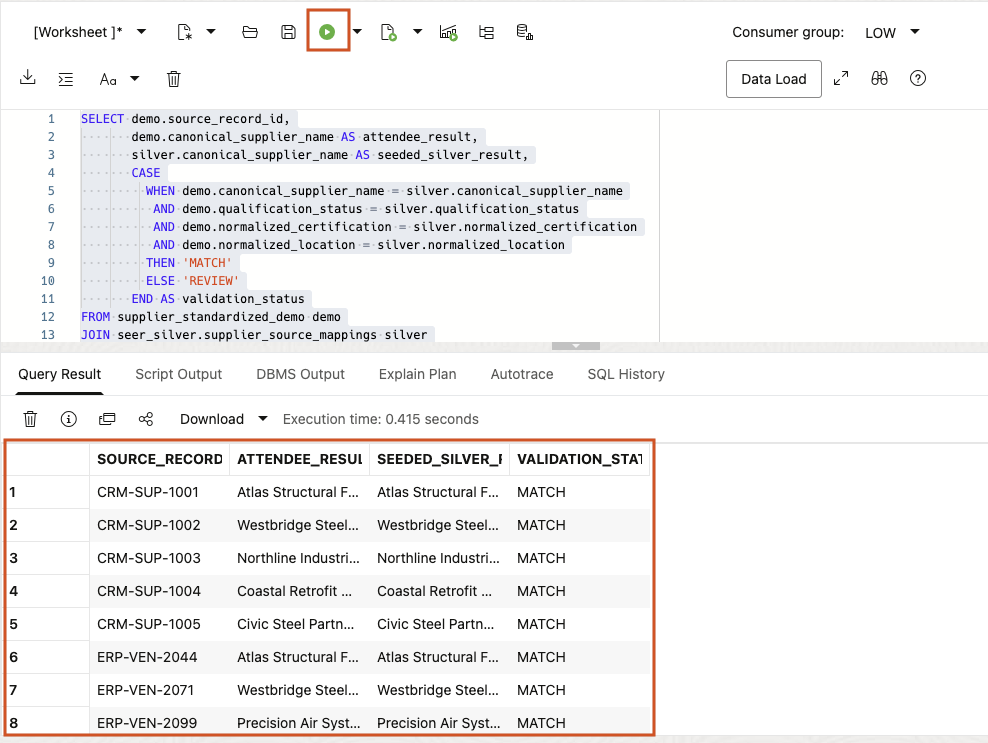

6. Confirm that all eight rows return `MATCH`. `SEER_SILVER.SUPPLIER_SOURCE_MAPPINGS` is the workshop's expected Silver reference result. A `MATCH` confirms that your transformation produced the expected standardized values for each supplier record.

    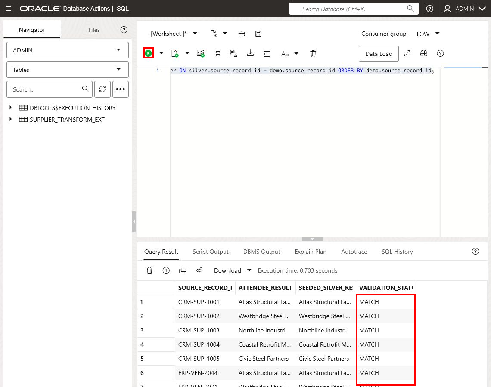

7. This exercise standardizes individual source records, which is one part of creating Silver data. A production Silver pipeline also performs cross-source entity matching, survivorship, validation, and quarantine of problem records. Catalog lineage provides the connection back to the source file and Object Storage path. Return to your **Catalog** tab you had previously used. In the **LOCAL** schema selector, choose the schema returned by `SELECT USER` in Task 1—**ADMIN** in this workshop session—then select **Apply**.

    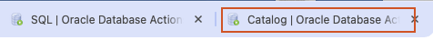
    
    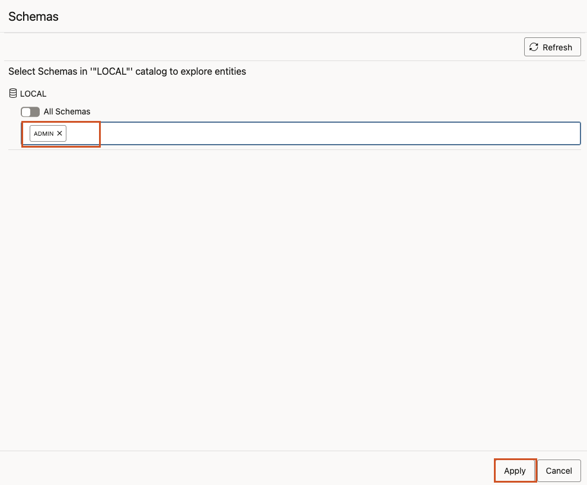

4. In **Entity** type, include **View**. Search for `SUPPLIER_STANDARDIZED_DEMO`, open the view, and select **Lineage**. Confirm the visual chain: `Object Storage URI` → `cloud-store link` → `SUPPLIER_TRANSFORM_EXT` → `SUPPLIER_STANDARDIZED_DEMO`. This proves that your view from Task 4 is not an isolated result: it can be traced through the Bronze external table to the original Object Storage file. This lineage supports impact analysis and helps users explain where a standardized supplier value came from.

    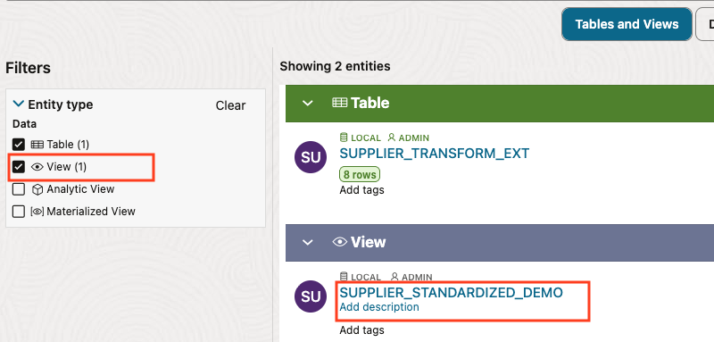
    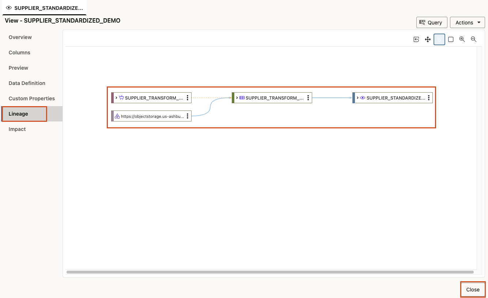

    **What you accomplished**
    You used SQL in Autonomous AI Lakehouse to turn source-shaped supplier data into a consistent Silver-style representation while retaining its source lineage.
    In Task 3, you saw that the Silver layer can reconcile several records into one trusted enterprise entity. This exercise demonstrates an earlier part of that process: standardizing individual source records so they are ready for matching, validation, and further Silver-layer processing.

    > **ALH Data Transforms alternative:** This lab uses SQL because the rules are concise and easy to validate. ALH Data Transforms can represent the same pattern visually using source, expression, mapping, validation, and target components. It also supports reusable connections, workflows, scheduling, and job monitoring. Production pipelines can use SQL, Data Transforms, or both, depending on the transformation.

## Task 5 (Optional): Trace the Austin steel-delivery event

In this task, you will trace one real-world business event—the reinforced-steel delivery for Seer’s Austin bank project—across the systems that recorded it.
Each source system captured a different part of the same delivery: CRM identifies the supplier, Fusion ERP records the purchase order and financial status, Primavera records the project milestone, and the on-premises inspection system records the receiving inspection. The lakehouse maps those source records to one canonical event, then presents the result as a consumer-ready Gold record. No data is changed in this task

This task has three parts:

-  Identify the source records mapped to the shared Austin steel-delivery event.
-  Review the standardized Silver event created from those records.
-  Review the Gold project context used for business decisions.


1. Return to your SQL Worksheet tab. Run the following query to locate the source-system records associated with the Austin steel delivery:

    ```sql
    <copy>
    SELECT source_system,
           source_object,
           source_record_id,
           source_description,
           canonical_event_id,
           match_method,
           match_confidence
    FROM seer_silver.source_record_mappings
    WHERE UPPER(canonical_business_term) = 'STEEL DELIVERY'
      AND UPPER(project_name) LIKE '%AUSTIN%'
    ORDER BY source_system, source_object;
    </copy>
    ```
    
    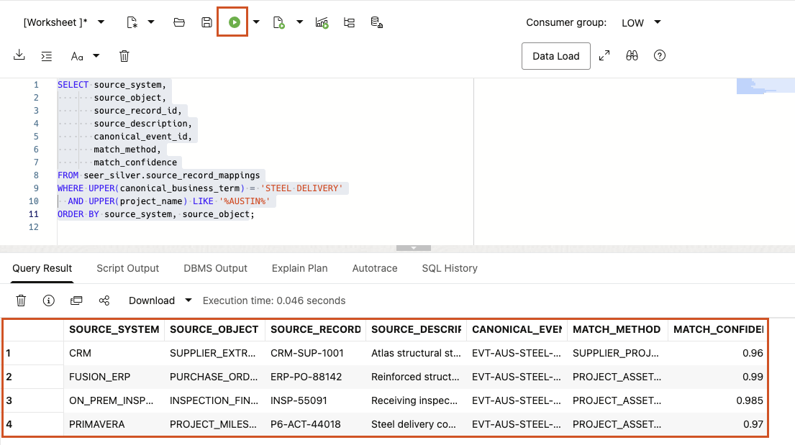

2. Review the results. The query returns one mapping row for each source record associated with this event, including financial, schedule, supplier, and inspection context. Although the source records have different IDs and descriptions, they share the same `CANONICAL_EVENT_ID`. `MATCH_METHOD` identifies how the pipeline associated a source record with the canonical event, and `MATCH_CONFIDENCE` indicates the confidence of that association. These mappings preserve the technical evidence needed to explain how the event was assembled

    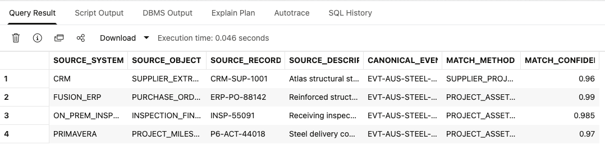

3. Run the following query to open the canonical Silver event:

    ```sql
    <copy>
    SELECT event_id,
           project_name,
           asset_name,
           event_type,
           planned_date,
           actual_date,
           supplier_name,
           financial_status,
           inspection_status
    FROM seer_silver.project_events
    WHERE event_id = (
      SELECT canonical_event_id
      FROM seer_silver.source_record_mappings
      WHERE UPPER(canonical_business_term) = 'STEEL DELIVERY'
        AND UPPER(project_name) LIKE '%AUSTIN%'
      FETCH FIRST 1 ROW ONLY
    );
    </copy>
    ```

    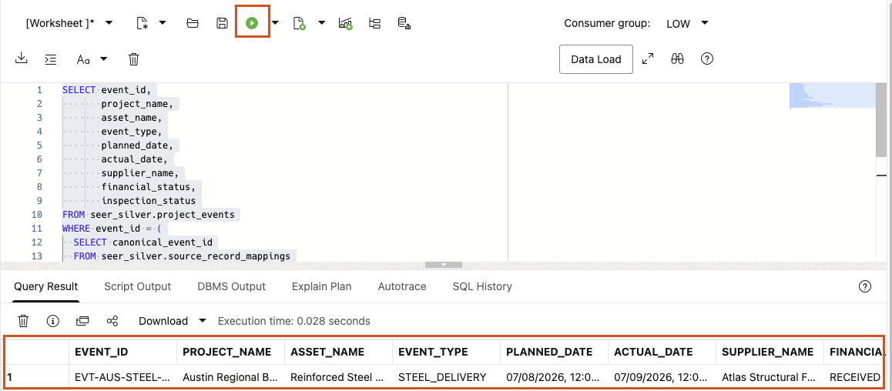

4. This query uses the shared `CANONICAL_EVENT_ID` from the mappings to retrieve one standardized event record. Review the project, asset, event type, planned and actual dates, supplier, financial status, and inspection status. At the Silver layer, the delivery is represented as one reconciled business event rather than separate CRM, ERP, schedule, and inspection records.

    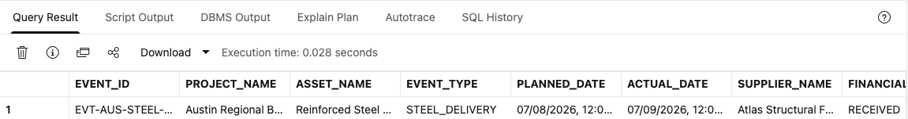

5. Run the following query to review the corresponding Gold record:

    ```sql
    <copy>
    SELECT project_name,
           asset_name,
           supplier_name,
           milestone_status,
           purchase_order_status,
           inspection_status,
           decision_readiness
    FROM seer_gold.project_context
    WHERE UPPER(project_name) LIKE '%AUSTIN%'
      AND UPPER(asset_name) LIKE '%STEEL%';
    </copy>
    ```

    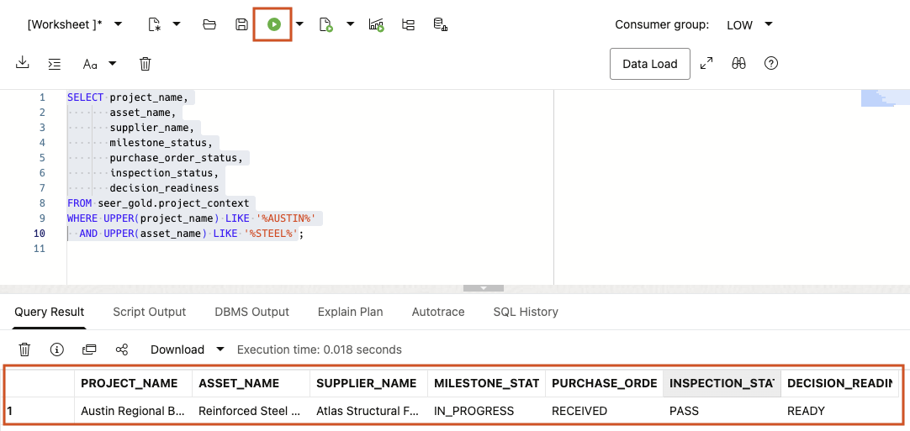

6. Review the results. This Gold record presents the project context that a business user needs: the supplier, milestone status, purchase-order status, inspection status, and overall decision readiness.

    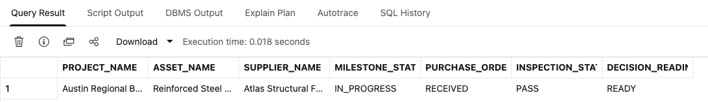

7. Compare the three results:

    - `SEER_SILVER.SOURCE_RECORD_MAPPINGS` shows the evidence that connects records from different systems to the same event.
    - `SEER_SILVER.PROJECT_EVENTS` provides the standardized, reconciled operational event.
    - `SEER_GOLD.PROJECT_CONTEXT` provides a stable, consumer-ready view for project decisions.

    The Gold record does not erase source differences. It resolves them into a trusted business object while preserving the Silver mappings needed to trace and explain the result.

## Task 6 (Optional): Review quality and lineage evidence

Trusted data requires evidence that it meets defined quality rules and can be traced back to its source. In this task, you will review that evidence for the workshop data. No data is changed in this task.

You will:

-  Review quality-rule results across the Bronze, Silver, and Gold layers.
-  Review records placed in quarantine for follow-up.
-  Trace your supplier-standardization view from Object Storage through its Bronze external table.
-  Review the recorded pipeline lineage for the seeded Gold project-context product.

1. Review the latest quality-rule results. In the SQL worksheet, run:

    ```sql
    <copy>
    SELECT layer_name,
           rule_name,
           rule_dimension,
           records_evaluated,
           records_failed,
           status,
           evaluated_at
    FROM seer_gold.data_quality_results
    ORDER BY evaluated_at DESC, layer_name, rule_name;
    </copy>
    ```

    Review the results. Each row records a quality rule that was run against a layer of the lakehouse. The results show the rule’s purpose, the number of records evaluated, the number that failed, its status, and when it was evaluated. A PASS indicates that the applicable rule was satisfied. A WARNING identifies an issue requiring follow-up; it does not necessarily prevent all data from advancing. The handling of warnings and failures depends on the organization’s data-quality policy.

    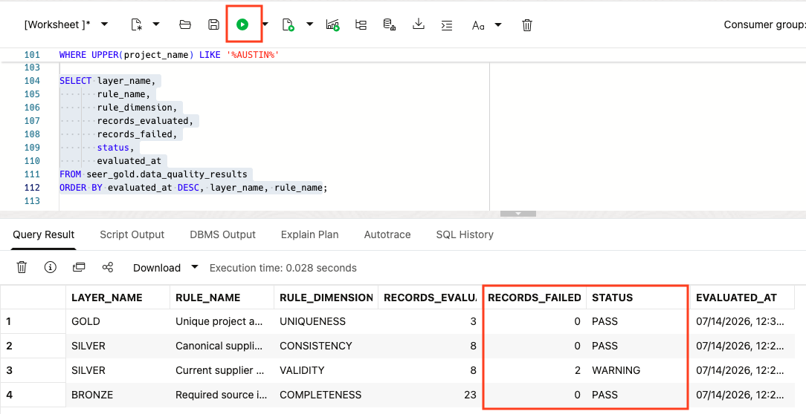

2. Review quarantined records. Run the following read-only query:

    ```sql
    <copy>
    SELECT source_system,
           source_record_id,
           failed_rule,
           failure_reason,
           quarantine_status
    FROM seer_silver.quarantined_records
    ORDER BY source_system, source_record_id;
    </copy>
    ```

    Review the results. These records did not satisfy a required quality rule and were placed in quarantine rather than silently deleted or presented as trusted data. The table retains the original source system and record ID, the rule that failed, the reason for the failure, and the record’s follow-up status. In business terms, quarantine makes data exceptions visible and actionable while preserving the evidence needed to correct them at the source or through an approved remediation process.

    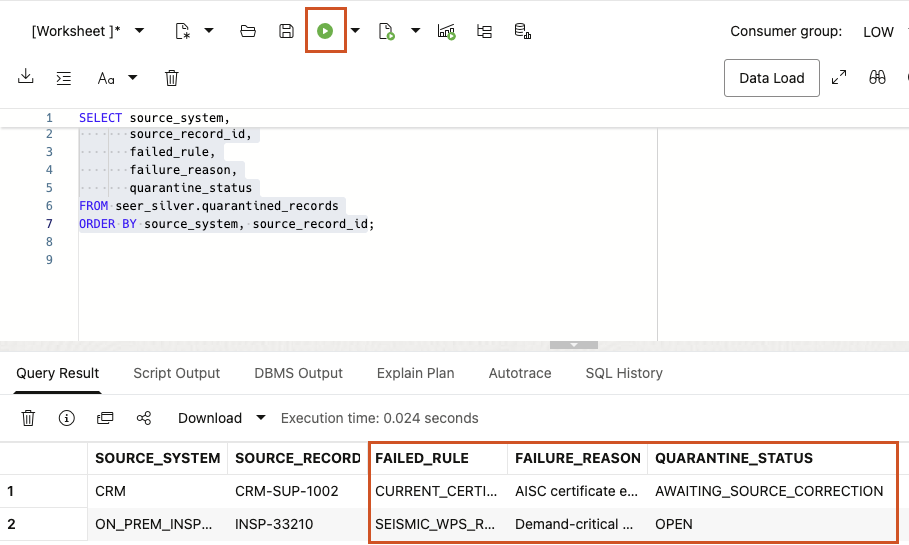

3. Return to your Catalog tab. In the **LOCAL** schema selector, choose the schema returned by `SELECT USER` in Task 1—**ADMIN** in this workshop session—then select **Apply**.

    
    
    

4. In **Entity type**, include **View**. Search for `SUPPLIER_STANDARDIZED_DEMO`, open the view, and select **Lineage**. Confirm the visual chain:

    `Object Storage URI` → cloud-store link → `SUPPLIER_TRANSFORM_EXT` → `SUPPLIER_STANDARDIZED_DEMO`

    
    

    This proves that your view from Task 4 is not an isolated result: it can be traced through the Bronze external table to the original Object Storage file. This lineage supports impact analysis and helps users explain where a standardized supplier value came from.

5. **Close** the view, return to the **SQL worksheet**, and run:

    ```sql
    <copy>
    SELECT target_object,
           source_object,
           transformation_name,
           pipeline_run_id,
           completed_at
    FROM seer_gold.lineage_summary
    WHERE target_object = 'SEER_GOLD.PROJECT_CONTEXT'
    ORDER BY completed_at DESC, source_object;
    </copy>
    ```

    Review the results. `SEER_GOLD.PROJECT_CONTEXT` is the target Gold product. Each returned row identifies an upstream source object, the transformation that contributed to the product, the pipeline run, and its completion time. The result shows how the Gold project-context product is built from its Silver entities and Bronze sources. The lineage summary complements Catalog lineage by preserving the complete seeded workshop pipeline history.

    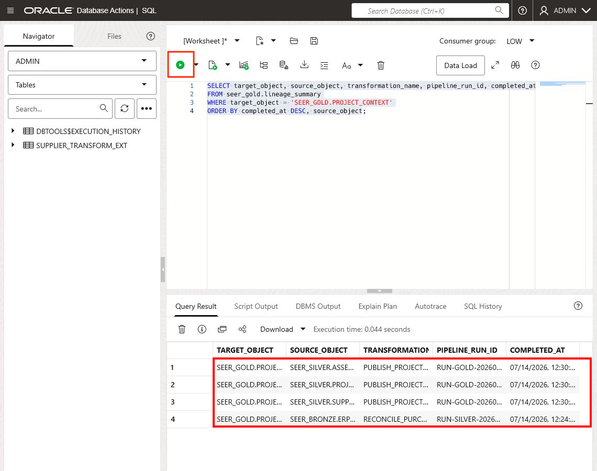

6. Summarize the evidence:

    The workshop has now demonstrated the controls behind a trusted consumer-ready data set:

    * Quality results show whether data met the rules expected at each layer.
    * Quarantine preserves and manages records that need follow-up.
    * Lineage traces a standardized view and a Gold product back through their transformations to upstream source data.

    Together, these controls help a business user trust the Gold product while allowing technical teams to investigate its quality and origin when needed.

## Lab 1 Recap

In this lab, you:

* Verified the pre-provisioned Autonomous AI Lakehouse environment.
* Linked a CSV in OCI Object Storage as `SUPPLIER_TRANSFORM_EXT`, a Bronze external table that ALH can query without copying the raw file into a managed database table.
* Inspected how Bronze, Silver, and Gold serve different purposes: preserving source evidence, standardizing enterprise entities, and delivering consumer-ready data sets.
* Created `SUPPLIER_STANDARDIZED_DEMO`, a SQL view that standardizes raw supplier records into a Silver-style result while retaining source and ingestion details for traceability.
* Validated the standardized result against the workshop’s seeded Silver reference mapping.
* Traced the Austin steel-delivery event across CRM, Fusion ERP, Primavera, and on-premises inspection records to a single canonical Silver event and Gold project-context product.
* Reviewed quality-rule results, quarantined records, and lineage evidence for both the attendee-created view and the seeded Gold product.

The key takeaway: connecting sources is only the beginning. A trusted lakehouse preserves raw-source evidence, standardizes and reconciles it into shared business entities, applies quality controls, and maintains lineage so consumer-ready data sets—and the AI applications that use them—are explainable and trustworthy.


## Learn More

- [Use external tables with Autonomous Database](https://docs.oracle.com/en/cloud/paas/autonomous-database/serverless/adbsb/query-external-data.html)
- [Link to objects in cloud storage with Data Studio](https://docs.oracle.com/en/cloud/paas/autonomous-database/serverless/adbsb/link-to-cloud.html)
- [Discover and Manage Data with Catalog in Autonomous AI Database](https://docs.oracle.com/en-us/iaas/autonomous-database-serverless/doc/catalog-entities.html)
- [Transform Data with Data Transforms in Autonomous AI Database](https://docs.oracle.com/en-us/iaas/autonomous-database-serverless/doc/autonomous-data-transforms.html)
- [OCI Object Storage documentation](https://docs.oracle.com/en-us/iaas/Content/Object/home.htm)

## Acknowledgements

- **Author:** Eli Schilling, Cloud Architect || Evangelist
- **Contributors:** Oracle LiveLabs and ONA Lab Experience Teams
- **Last Updated By / Date:** ONA Lab Experience team, July 2026
