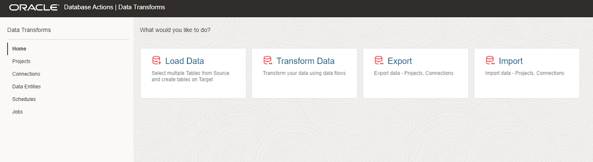
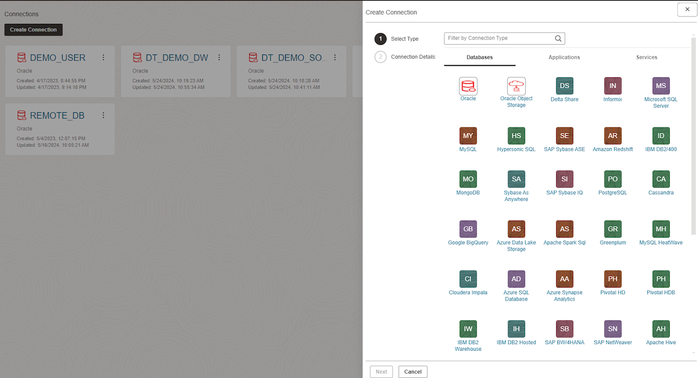
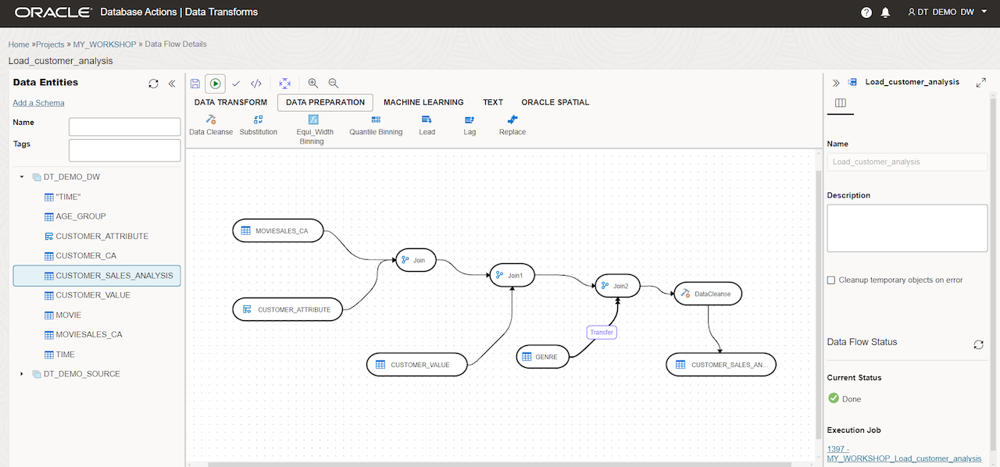
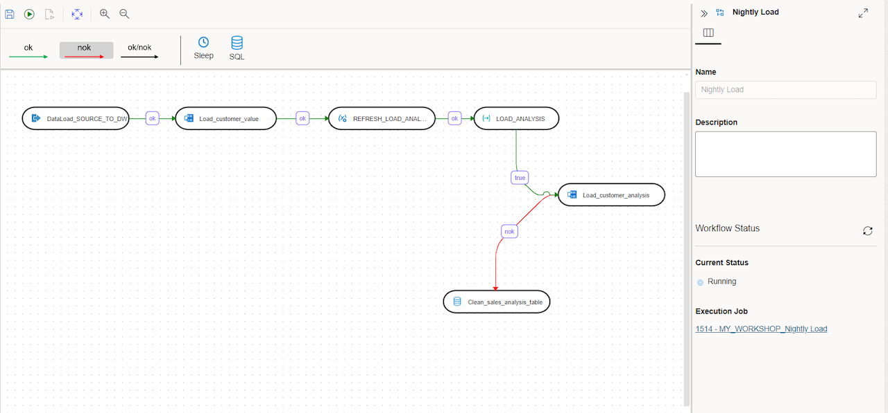
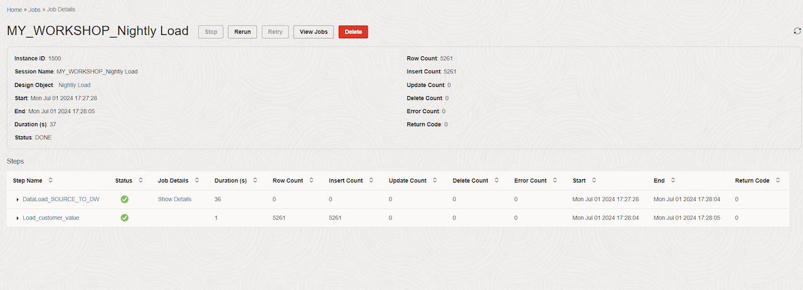

# Lab 2: Unify Data for AI Applications

## Introduction

Lab 1 established a trusted foundation for structured data. In this lab, you extend that foundation to AI applications by combining Gold business context with searchable document evidence.
Gold consumer-ready data sets make trusted project facts easier for applications and AI to consume, but applications and agents also need detailed evidence from contracts, specifications, inspection reports, and compliance documents. You will explore how Oracle Autonomous AI Lakehouse keeps structured facts and unstructured document evidence governed together, then use semantic search to find engineering-specification content relevant to the Austin project.

The workshop setup has already created the document relationships, chunks, embeddings, and vector index inside ALH. Your task is to inspect and use these prepared assets; you do not need to create them. No data is changed in this lab.

**Estimated Time:** 20 minutes

### Objectives

In this lab, you will:

* Inspect the Gold consumer-ready data sets and document evidence intended for applications and agents.
* Compare relational, JSON, and relationship representations of governed data.
* Review how source documents are prepared for semantic retrieval.
* Use vector search to find Austin engineering evidence by meaning.
* Combine retrieved document evidence with structured project context.
* Trace the retrieved evidence back to its governed source object and version.

### Prerequisites

- Completion of Lab 1
- Read access to `SEER_GOLD`
- The `SEER_WORKSHOP.ALL_MINILM_L12_V2` embedding model loaded in the database
- Precomputed embeddings and a valid vector index on `SEER_GOLD.DOCUMENT_CHUNKS`

## Task 1: Inspect the consumer-ready Gold data sets

Applications and agents should consume stable, business-oriented data products rather than reconstructing joins across raw source systems. In this task, you will inspect the Gold products available to the downstream Construction Evaluation Agent.

1. Switch back to your **Catalog** tab.

    

2. Confirm that **LOCAL** is the selected catalog. In the **LOCAL** schema selector, replace the current schema with `SEER_GOLD`, then select **Apply**. Search for `DATA_PRODUCT_CATALOG`.

    
    
    

3. Open `SEER_GOLD.DATA_PRODUCT_CATALOG` and select **Preview**. Review each data set’s business purpose, owner, refresh frequency, quality status, and intended consumers. `DATA_PRODUCT_CATALOG` is a business-facing register of approved data products. It helps a team understand which products are available, who owns them, and whether they are suitable for a particular consumer.

4. Locate the consumer-ready assets used by the Construction Evaluation Agent:

    Structured data sets:
    - `PROJECT_CONTEXT`
    - `SUPPLIER_RECOMMENDATIONS`
    - `SUPPLIER_PROFILE`

    Searchable document evidence:
    - `DOCUMENT_CHUNKS`

    

5. Select **Close** to return to the Catalog search results. Search for `SUPPLIER_RECOMMENDATIONS`, then open `SEER_GOLD.SUPPLIER_RECOMMENDATIONS`.

    

6. Use **Preview** to inspect the project, supplier, fit score, risk level, recommendation status, and missing-information fields. Notice that `SUPPLIER_RECOMMENDATIONS` is a prepared, consumer-ready data set. It provides a stable decision-support structure without exposing raw ingestion fields or requiring an application to reconstruct the source joins.

    

## Task 2 (Optional): Compare the data shapes

The same governed business data can be exposed through different data shapes without creating separate, unsynchronized copies. In this task, you will inspect relational facts, flexible JSON attributes, and entity relationships.

1. From the current Catalog entity page, select **Close**. Switch back to your SQL Worksheet tab.

    

2. Run the following query to view relational project facts for Austin:

    ```sql
    <copy>
    SELECT project_name, asset_name, current_milestone, inspection_status
    FROM seer_gold.project_context
    WHERE UPPER(project_name) LIKE '%AUSTIN%';
    </copy>
    ```
    
    

    This relational result provides a simple, tabular view of the project, asset, schedule milestone, and inspection status. It is well suited to reports, dashboards, and application queries.

3. Run the following query to inspect flexible asset attributes stored as JSON:

    ```sql
    <copy>
    SELECT asset_name,
           JSON_VALUE(specifications, '$.material_grade') AS material_grade,
           JSON_VALUE(specifications, '$.design_standard') AS design_standard,
           JSON_VALUE(
             specifications,
             '$.fire_rating_minutes' RETURNING NUMBER
           ) AS fire_rating_minutes
    FROM seer_gold.asset_profiles
    WHERE UPPER(project_name) LIKE '%AUSTIN%';
    </copy>
    ```

    `SPECIFICATIONS` stores flexible technical attributes as a JSON document. `JSON_VALUE` retrieves individual attributes from that document as queryable columns. This lets the model evolve without requiring a new relational column for every possible specification attribute.

    

4. Run the following query to explore the prebuilt relationship projection

    ```sql
    <copy>
    SELECT from_entity_name,
           relationship_type,
           to_entity_name,
           relationship_source
    FROM seer_gold.asset_relationships
    WHERE UPPER(from_entity_name) LIKE '%AUSTIN%'
       OR UPPER(to_entity_name) LIKE '%AUSTIN%'
    ORDER BY from_entity_name, relationship_type;
    </copy>
    ```

    This result describes how governed entities are related, such as a project to an asset or an asset to another business object. The relationship projection can support graph-style application queries without requiring the learner to create graph definitions in this workshop.

      

## Task 3: Inspect the document preparation pipeline

Before an AI application can retrieve document evidence reliably, each source document must be registered, processed into meaningful chunks, enriched with metadata, embedded, and indexed.

1. Switch to your **Catalog** tab. Make sure in **LOCAL** schema selector, you have selected `SEER_GOLD`. Search for `DOCUMENT_CATALOG`.

    
    

2. Open `SEER_GOLD.DOCUMENT_CATALOG` and select **Preview**. Locate each document's name, type, project, asset, version, Object Storage URI, and classification. Select **Columns** to inspect the registered metadata contract.

    
    

3. Select **Close** to return to the Catalog results. Search for `DOCUMENT_CHUNKS`, then open `SEER_GOLD.DOCUMENT_CHUNKS`. Select **Preview**, inspect the column definitions and statistics, and locate the chunk sequence, page and section metadata, embedding model, embedding status, and source identifiers. A chunk is a meaningful section of a document, such as a section or passage. Each chunk retains the metadata needed to retrieve it, connect it to the right project or asset, and trace it to the source document.

    
    

4. Select **Close** to exit the DOCUMENT_CHUNKS table view. Switch back to your SQL Worksheet tab, and run the following query to inspect prepared chunks for the Austin project:

    ```sql
    <copy>
    SELECT document_name,
           section_title,
           chunk_sequence,
           character_count,
           embedding_model,
           embedding_status
    FROM seer_gold.document_chunks
    WHERE UPPER(project_name) LIKE '%AUSTIN%'
    ORDER BY document_name, chunk_sequence;
    </copy>
    ```

    

    Confirm that the Austin documents have been divided into ordered chunks and that their embeddings have been generated successfully.

    

5. Review the preparation stages:

    * Register the original Object Storage object and version.
    * Extract text while retaining page and section boundaries.
    * Create chunks sized for coherent retrieval.
    * Attach project, asset, supplier, classification, and provenance metadata.
    * Generate embeddings inside the Oracle security boundary.
    * Build or refresh the vector index.

    Chunking is a data-quality decision. An embedding can be technically valid but still produce poor retrieval if its chunk omits a heading, combines unrelated topics, or loses source metadata.

## Task 4: Find relevant document evidence with semantic search

Semantic search finds document passages by meaning, not only by exact wording. This query converts **“Austin structural specifications”** into an embedding, compares it with the stored document-chunk embeddings, and returns the five closest matches. A lower `SEMANTIC_DISTANCE` means a closer conceptual match.

1. In the SQL Worksheet, run the following semantic-search query:

    ```sql
    <copy>
    SELECT document_name,
           section_title,
           page_number,
           chunk_text,
           VECTOR_DISTANCE(
             embedding,
             VECTOR_EMBEDDING(
               SEER_WORKSHOP.ALL_MINILM_L12_V2
               USING 'Austin structural specifications' AS DATA
             ),
             COSINE
           ) AS semantic_distance
    FROM seer_gold.document_chunks
    WHERE embedding IS NOT NULL
    ORDER BY semantic_distance
    FETCH APPROX FIRST 5 ROWS ONLY;
    </copy>
    ```

    

2. Review the results. The query returns the five most relevant document chunks, including the source document, section, page, passage text, and semantic distance. Notice that a relevant Austin engineering-specification section can rank highly even when it does not contain the exact phrase “**Austin structural specifications.**”

3. Record the `DOCUMENT_NAME` from the best result. You will use it in Task 5 to verify the document’s provenance.

4. Compare this with an exact phrase match:

    ```sql
    <copy>
    SELECT document_name, section_title, page_number, chunk_text
    FROM seer_gold.document_chunks
    WHERE UPPER(chunk_text) LIKE '%AUSTIN STRUCTURAL SPECIFICATIONS%';
    </copy>
    ```

    

5. Review the result. It may return no rows because no chunk contains that exact phrase. This illustrates the difference:

    * Semantic search finds related meaning.
    * Exact phrase matching finds only the literal words.

    In production, use semantic search for natural-language questions. Use full-text or exact matching when names, codes, contract numbers, or exact phrases matter. Many applications combine both approaches.

## Task 5: Connect retrieved document evidence to business context

A relevant document passage is useful, but it does not tell the whole business story. An application also needs the project and asset details associated with that passage.

1. In the SQL Worksheet, run the query below. The first part of the query finds the three document chunks most similar in meaning to “**Austin structural specifications.**” The second part joins those chunks to `SEER_GOLD.PROJECT_CONTEXT` using `PROJECT_ID` and `ASSET_ID`.

    ```sql
    <copy>
    WITH ranked_chunks AS (
      SELECT document_id,
             document_name,
             section_title,
             page_number,
             project_id,
             asset_id,
             chunk_text,
             VECTOR_DISTANCE(
               embedding,
               VECTOR_EMBEDDING(
                 SEER_WORKSHOP.ALL_MINILM_L12_V2
                 USING 'Austin structural specifications' AS DATA
               ),
               COSINE
             ) AS semantic_distance
      FROM seer_gold.document_chunks
      WHERE embedding IS NOT NULL
      ORDER BY semantic_distance
      FETCH APPROX FIRST 3 ROWS ONLY
    )
    SELECT p.project_name,
           p.asset_name,
           p.current_milestone,
           p.purchase_order_status,
           p.inspection_status,
           r.document_name,
           r.section_title,
           r.page_number,
           r.chunk_text,
           r.semantic_distance
    FROM ranked_chunks r
    JOIN seer_gold.project_context p
      ON p.project_id = r.project_id
     AND p.asset_id = r.asset_id
    ORDER BY r.semantic_distance;
    </copy>
    ```
    

2. Review the results. Each row combines:

    * **Document evidence:** the document name, section, page, and retrieved passage.
    * **Business context:** the project, asset, current milestone, purchase-order status, and inspection status.
    * **Retrieval score:** `SEMANTIC_DISTANCE`; lower values indicate a closer semantic match.

    In other words, the query answers: _Which specification passages are relevant, and what is the current status of the project and asset they relate to?_

3. Verify the source of one returned document.

    Choose one of the following documents:

    * `austin_structural_engineering_specification.pdf`
    * `atlas_supplier_framework_agreement.pdf`

    Replace `<document name>` in the following query with your selected document name, then run it.


    ```sql
    <copy>
    SELECT document_name,
           object_uri,
           object_version,
           source_modified_at,
           extracted_at,
           chunking_policy,
           embedding_model,
           classification
    FROM seer_gold.document_provenance
    WHERE document_name = '<document name returned by your search>';
    </copy>
    ```

    

4. Review the provenance record. Confirm:

    * the original Object Storage location and object version;
    * when the source was changed and extracted;
    * the chunking policy and embedding model used;
    * the document’s classification.

    This makes the retrieved evidence explainable and traceable: an application can show not only _what_ it found, but also _where it came from and how it was prepared._


## Lab 2 Recap

In this lab, you:

* identified the consumer-ready Gold data products available to applications and AI agents;
* examined how document content is extracted, chunked, enriched with metadata, embedded, and indexed;
* used semantic search to retrieve document passages based on meaning;
* compared semantic retrieval with exact keyword matching;
* joined retrieved document evidence to related project and asset context;
* verified the source, version, processing details, and classification of retrieved evidence.

Key takeaway: AI applications need more than a relevant passage. They need trusted evidence, the business context to interpret it, and provenance that lets users verify the answer.


## Labs 1–2 Wrap-Up: Building AI-Ready Data Context

In Labs 1 and 2, you followed the path from enterprise source data and documents to trusted context that applications and AI agents can use.
You learned how to:

* prepare and publish consumer-ready Gold data products;
* inspect how documents are extracted, chunked, enriched with metadata, embedded, and indexed;
* retrieve relevant document passages using semantic search;
* compare semantic search with exact phrase matching;
* combine retrieved document evidence with current project and asset context;
* verify the source, version, processing details, and classification of retrieved evidence.

The key takeaway: a reliable AI response needs more than a relevant document passage. It needs trusted business data, traceable source evidence, and the context required to interpret both.


## Operationalizing the Pattern with Data Transforms

The SQL steps in these labs make the pattern easy to understand and test. In a production implementation, teams can use Oracle Data Transforms to make the data-integration workflow repeatable, scheduled, and monitored.
Oracle Data Transforms is a visual, low-code ETL/ELT tool integrated with Oracle Data Studio for Autonomous AI Database. It helps teams automate data loading, transformation, cleansing, enrichment, and publication.



_Data Transforms brings data loads, transformation flows, connections, schedules, and job monitoring into one workspace._

**Connect to source systems**

Teams create reusable connections to the systems that supply or receive data, including databases, Object Storage, applications, and supported services.



_Connections provide the reusable link between Data Transforms and source or target systems._

**Build and publish data products**

Data Transforms supports the medallion pattern used in these labs: move source data and documents through Bronze ingestion, Silver standardization and validation, and Gold consumer-ready data products. Data flows define the transformations and provide built-in capabilities for mappings, joins, filters, expressions, and validation rules.



_A visual data flow combines source data, transformations, data-preparation steps, and a target dataset._

**Orchestrate and monitor the pipeline**

**Workflow orchestration** coordinates dependent data flows and steps, uses variables and conditional logic, schedules recurring runs, and can route a failed step to an appropriate remediation path.



_A workflow orchestrates dependent data flows, conditional success or failure paths, and remediation steps as one pipeline._

Each execution is recorded so teams can review status, steps, rows processed, duration, and errors.



_Job details provide operational visibility into each pipeline run._

```text
New or changed source data and documents
→ ingest and validate
→ transform and publish Gold data products
→ process and index approved documents
→ refresh the searchable document index
→ monitor quality, lineage, freshness, and failures
```
For document search, a workflow can identify new or changed approved documents and orchestrate the processing steps that extract text, create chunks, enrich metadata, and generate embeddings. The resulting chunks and vectors are published to the searchable document index. At question time, an application or AI agent retrieves the most relevant chunks and combines them with current Gold business data.

**SQL helps teams explore and validate the pattern. Data Transforms makes the data-integration workflow repeatable, scheduled, monitored, and ready to operate at business scale.**

### Optional Take-Home: Lab 3

Lab 3 is an optional readiness review. It examines the operational and governance evidence behind a consumer-ready data sets: pipeline runs, quality and freshness checks, published contracts, consumer mappings, and the final AI-readiness assessment. Its key question is: “Is this Gold consumer-ready data set not only useful, but safe and reliable to hand to developers and AI agents?”

## Learn More

- [Discover and Manage Data with Catalog in Autonomous AI Database](https://docs.oracle.com/en-us/iaas/autonomous-database-serverless/doc/catalog-entities.html)
- [Oracle AI Vector Search User's Guide](https://docs.oracle.com/en/database/oracle/oracle-database/26/vecse/)
- [Generate vector embeddings in Oracle Database](https://docs.oracle.com/en/database/oracle/oracle-database/26/vecse/generate-vector-embeddings.html)
- [JSON in Oracle Database](https://docs.oracle.com/en/database/oracle/oracle-database/26/adjsn/)

## Acknowledgements

- **Author:** Eli Schilling, Cloud Architect || Evangelist
- **Contributors:** Oracle LiveLabs and ONA Lab Experience Teams
- **Last Updated By / Date:** ONA Lab Experience team, July 2026
