# Lab 2: Unify Data for AI Applications

## Introduction

Lab 1 established a trusted foundation for structured data. In this lab, you extend that foundation to AI applications by combining Gold business context with searchable document evidence.
Gold consumer-ready data sets make trusted project facts easier for applications and AI to consume, but applications and agents also need detailed evidence from contracts, specifications, inspection reports, and compliance documents. You will explore how Oracle Autonomous AI Lakehouse keeps structured facts and unstructured document evidence governed together, then use semantic search to find engineering-specification content relevant to the Austin project.

The workshop setup has already created the document relationships, chunks, embeddings, and vector index inside ALH. Your task is to inspect and use these prepared assets; you do not need to create them. No data is changed in this lab.

**Estimated Time:** 20 minutes

### Objectives

In this lab, you will:

* Inspect the Gold consumer-ready data sets and document evidence intended for applications and agents.
* Compare relational, JSON, and relationship representations of governed data.
* Review how source documents are prepared for semantic retrieval.
* Use vector search to find Austin engineering evidence by meaning.
* Combine retrieved document evidence with structured project context.
* Trace the retrieved evidence back to its governed source object and version.

### Prerequisites

- Completion of Lab 1
- Read access to `SEER_GOLD`
- The `SEER_WORKSHOP.ALL_MINILM_L12_V2` embedding model loaded in the database
- Precomputed embeddings and a valid vector index on `SEER_GOLD.DOCUMENT_CHUNKS`

## Task 1: Inspect the consumer-ready Gold data sets

Applications and agents should consume stable, business-oriented data products rather than reconstructing joins across raw source systems. In this task, you will inspect the Gold products available to the downstream Construction Evaluation Agent.

1. From the Database Actions Launchpad, select **Data Studio**, then select **Catalog**.

    

2. Confirm that **LOCAL** is the selected catalog. In the **LOCAL** schema selector, replace the current schema with `SEER_GOLD`, then select **Apply**. Search for `DATA_PRODUCT_CATALOG`.

    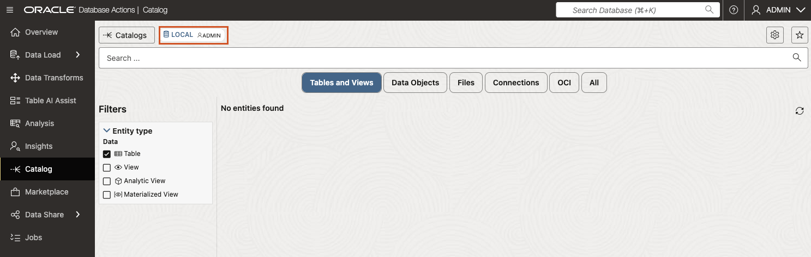
    
    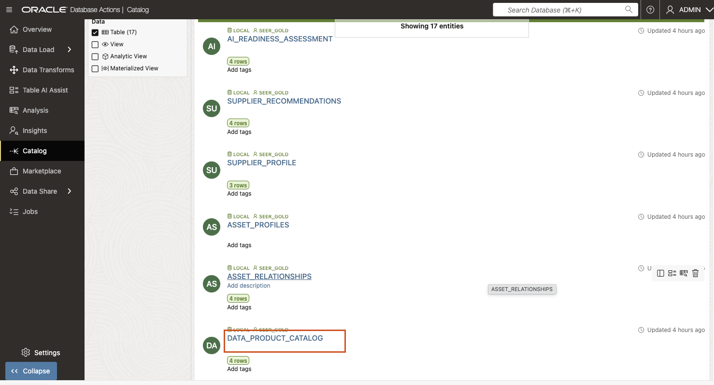

3. Open `SEER_GOLD.DATA_PRODUCT_CATALOG` and select **Preview**. Review each data set’s business purpose, owner, refresh frequency, quality status, and intended consumers. `DATA_PRODUCT_CATALOG` is a business-facing register of approved data products. It helps a team understand which products are available, who owns them, and whether they are suitable for a particular consumer.

4. Locate the consumer-ready assets used by the Construction Evaluation Agent:

    Structured data sets:
    - `PROJECT_CONTEXT`
    - `SUPPLIER_RECOMMENDATIONS`
    - `SUPPLIER_PROFILE`

    Searchable document evidence:
    - `DOCUMENT_CHUNKS`

    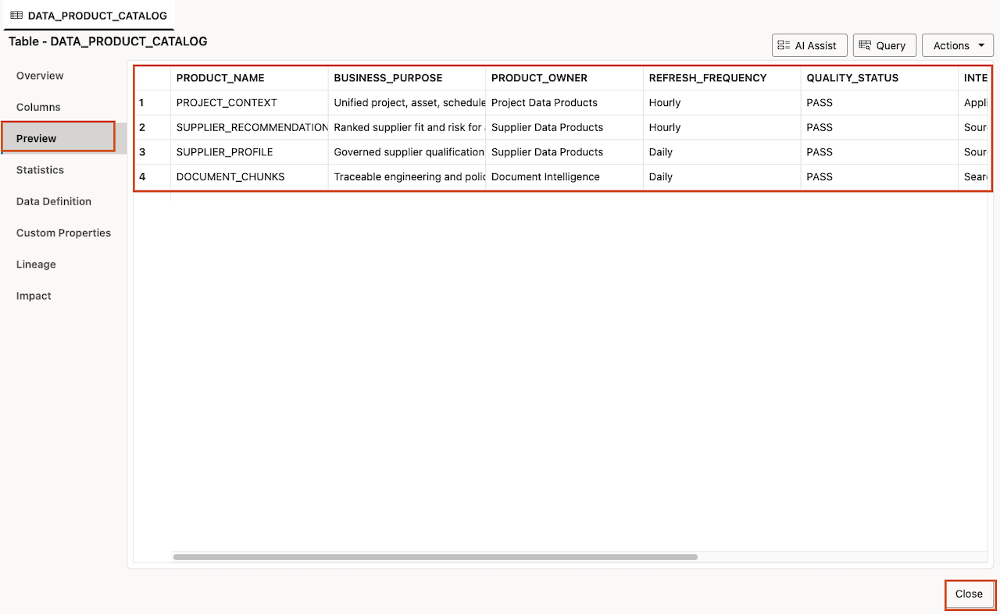

5. Select **Close** to return to the Catalog search results. Search for `SUPPLIER_RECOMMENDATIONS`, then open `SEER_GOLD.SUPPLIER_RECOMMENDATIONS`.

    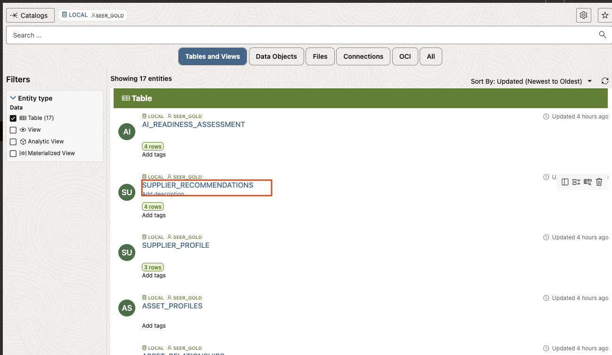

6. Use **Preview** to inspect the project, supplier, fit score, risk level, recommendation status, and missing-information fields. Notice that `SUPPLIER_RECOMMENDATIONS` is a prepared, consumer-ready data set. It provides a stable decision-support structure without exposing raw ingestion fields or requiring an application to reconstruct the source joins.

    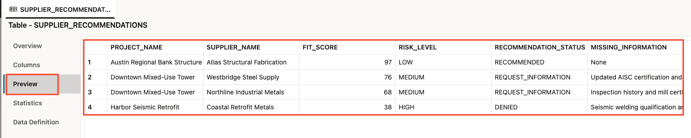

## Task 2 (Optional): Compare the data shapes

The same governed business data can be exposed through different data shapes without creating separate, unsynchronized copies. In this task, you will inspect relational facts, flexible JSON attributes, and entity relationships.

1. From the current Catalog entity page, select **Close**. Return to the Database Actions Launchpad, select **SQL** under **Development** to open the SQL Worksheet.

    

2. Run the following query to view relational project facts for Austin:

    ```sql
    <copy>
    SELECT project_name, asset_name, current_milestone, inspection_status
    FROM seer_gold.project_context
    WHERE UPPER(project_name) LIKE '%AUSTIN%';
    </copy>
    ```
    
    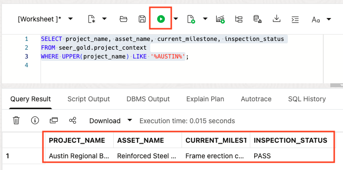

    This relational result provides a simple, tabular view of the project, asset, schedule milestone, and inspection status. It is well suited to reports, dashboards, and application queries.

3. Run the following query to inspect flexible asset attributes stored as JSON:

    ```sql
    <copy>
    SELECT asset_name,
           JSON_VALUE(specifications, '$.material_grade') AS material_grade,
           JSON_VALUE(specifications, '$.design_standard') AS design_standard,
           JSON_VALUE(
             specifications,
             '$.fire_rating_minutes' RETURNING NUMBER
           ) AS fire_rating_minutes
    FROM seer_gold.asset_profiles
    WHERE UPPER(project_name) LIKE '%AUSTIN%';
    </copy>
    ```

    `SPECIFICATIONS` stores flexible technical attributes as a JSON document. `JSON_VALUE` retrieves individual attributes from that document as queryable columns. This lets the model evolve without requiring a new relational column for every possible specification attribute.

    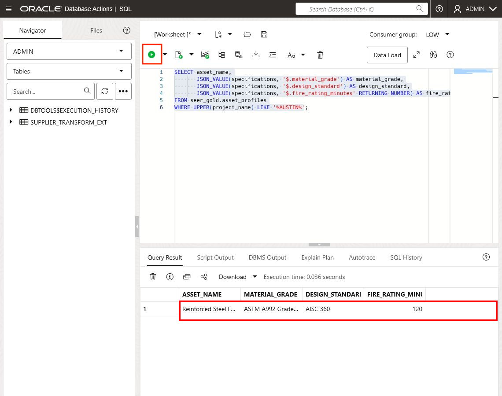

4. Run the following query to explore the prebuilt relationship projection

    ```sql
    <copy>
    SELECT from_entity_name,
           relationship_type,
           to_entity_name,
           relationship_source
    FROM seer_gold.asset_relationships
    WHERE UPPER(from_entity_name) LIKE '%AUSTIN%'
       OR UPPER(to_entity_name) LIKE '%AUSTIN%'
    ORDER BY from_entity_name, relationship_type;
    </copy>
    ```

    This result describes how governed entities are related, such as a project to an asset or an asset to another business object. The relationship projection can support graph-style application queries without requiring the learner to create graph definitions in this workshop.

      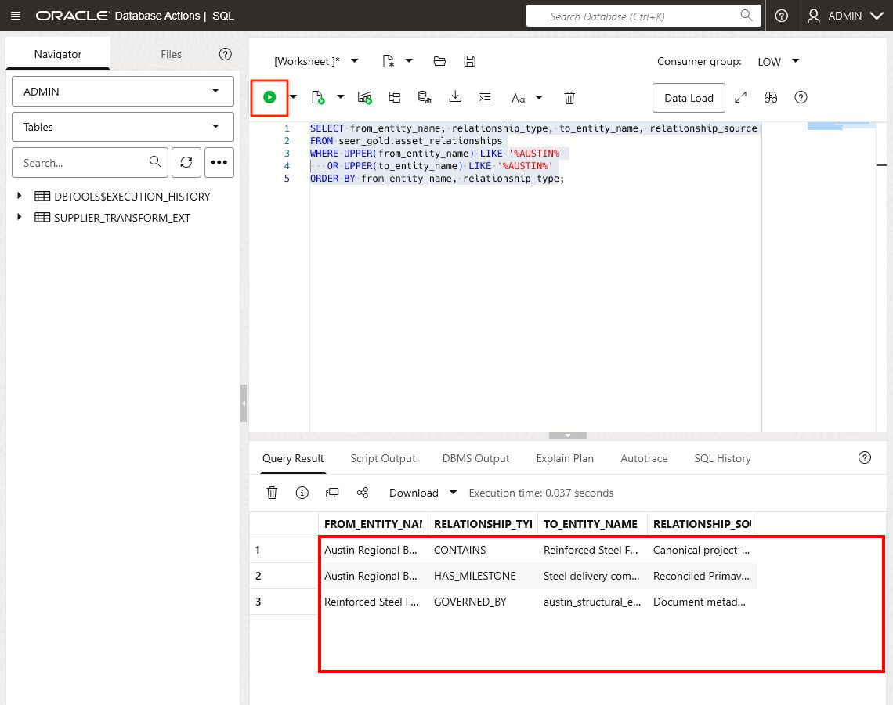

## Task 3: Inspect the document preparation pipeline

Before an AI application can retrieve document evidence reliably, each source document must be registered, processed into meaningful chunks, enriched with metadata, embedded, and indexed.

1. Return to the Database Actions Launchpad, select **Catalog** under **Data Studio**. In the **LOCAL** schema selector, select `SEER_GOLD`, then select **Apply**. Search for `DOCUMENT_CATALOG`.

    
    
    
    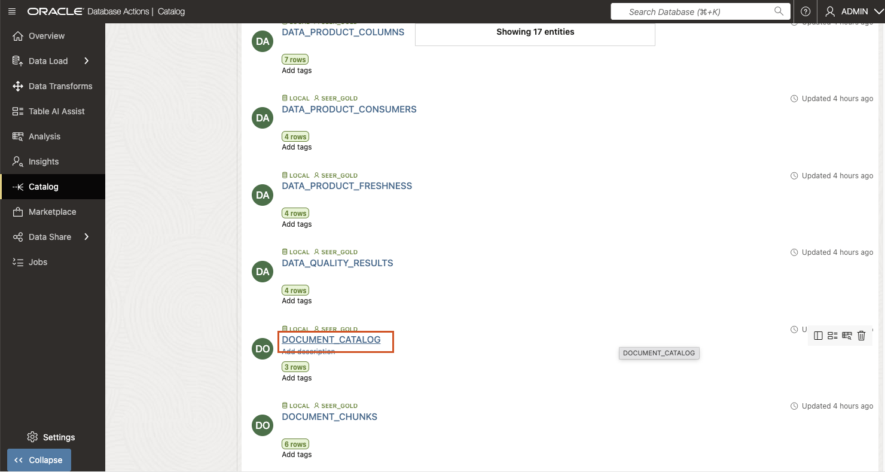

2. Open `SEER_GOLD.DOCUMENT_CATALOG` and select **Preview**. Locate each document's name, type, project, asset, version, Object Storage URI, and classification. Select **Columns** to inspect the registered metadata contract.

    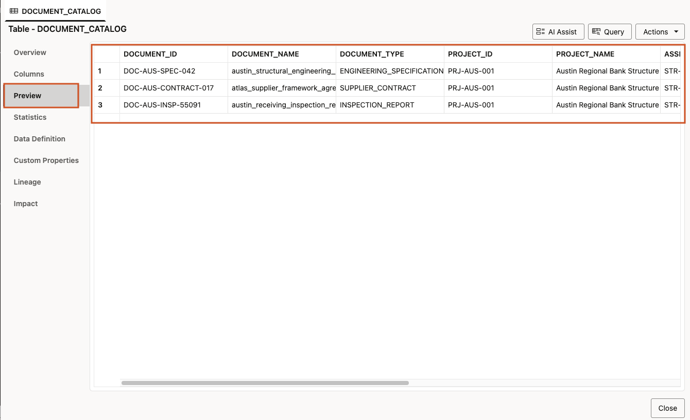
    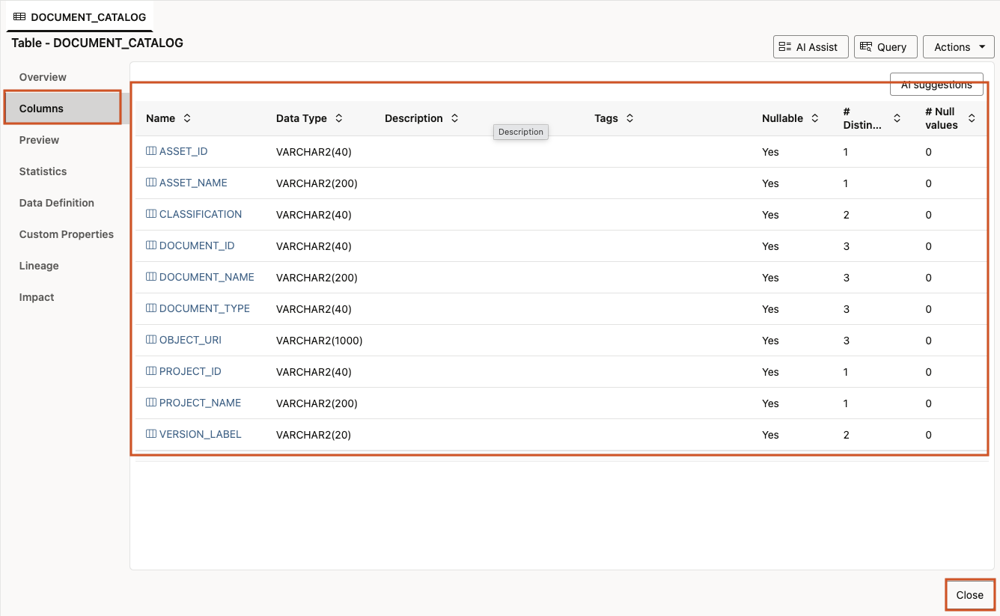

3. Select **Close** to return to the Catalog results. Search for `DOCUMENT_CHUNKS`, then open `SEER_GOLD.DOCUMENT_CHUNKS`. Select **Preview**, inspect the column definitions and statistics, and locate the chunk sequence, page and section metadata, embedding model, embedding status, and source identifiers. A chunk is a meaningful section of a document, such as a section or passage. Each chunk retains the metadata needed to retrieve it, connect it to the right project or asset, and trace it to the source document.

    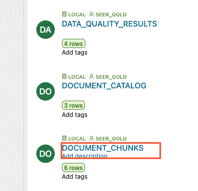
    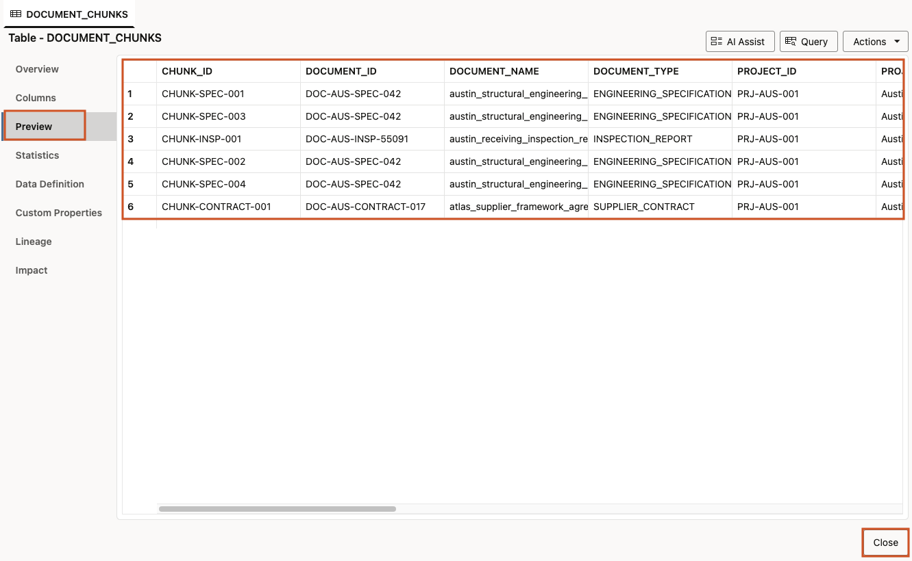

4. Select **Close** to exit the DOCUMENT_CHUNKS table view. Return to the Database Actions Launchpad, select **SQL** under **Development** to open the SQL Worksheet, and run the following query to inspect prepared chunks for the Austin project:

    ```sql
    <copy>
    SELECT document_name,
           section_title,
           chunk_sequence,
           character_count,
           embedding_model,
           embedding_status
    FROM seer_gold.document_chunks
    WHERE UPPER(project_name) LIKE '%AUSTIN%'
    ORDER BY document_name, chunk_sequence;
    </copy>
    ```

    

    Confirm that the Austin documents have been divided into ordered chunks and that their embeddings have been generated successfully.

    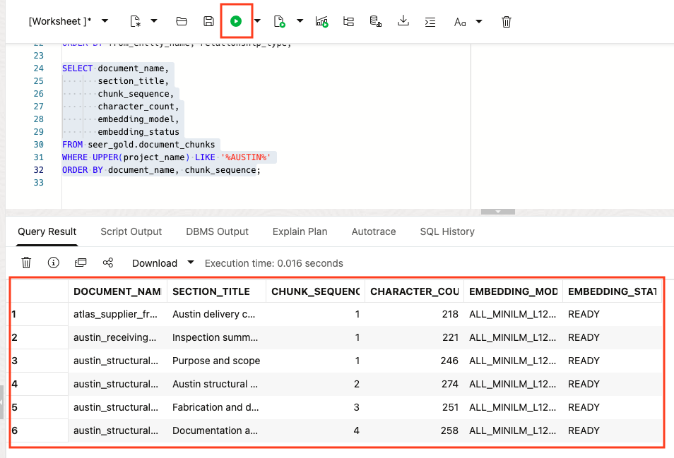

5. Review the preparation stages:

    * Register the original Object Storage object and version.
    * Extract text while retaining page and section boundaries.
    * Create chunks sized for coherent retrieval.
    * Attach project, asset, supplier, classification, and provenance metadata.
    * Generate embeddings inside the Oracle security boundary.
    * Build or refresh the vector index.

    Chunking is a data-quality decision. An embedding can be technically valid but still produce poor retrieval if its chunk omits a heading, combines unrelated topics, or loses source metadata.

## Task 4: Search for Austin structural specifications

Semantic search finds content with similar meaning, not only content containing the exact search phrase. In this task, the query converts the search phrase into an embedding and compares it with the stored document-chunk embeddings. A lower `SEMANTIC_DISTANCE` means a closer semantic match.

1. In the SQL Worksheet, run the following semantic-search query:

    ```sql
    <copy>
    SELECT document_name,
           section_title,
           page_number,
           chunk_text,
           VECTOR_DISTANCE(
             embedding,
             VECTOR_EMBEDDING(
               SEER_WORKSHOP.ALL_MINILM_L12_V2
               USING 'Austin structural specifications' AS DATA
             ),
             COSINE
           ) AS semantic_distance
    FROM seer_gold.document_chunks
    WHERE embedding IS NOT NULL
    ORDER BY semantic_distance
    FETCH APPROX FIRST 5 ROWS ONLY;
    </copy>
    ```

    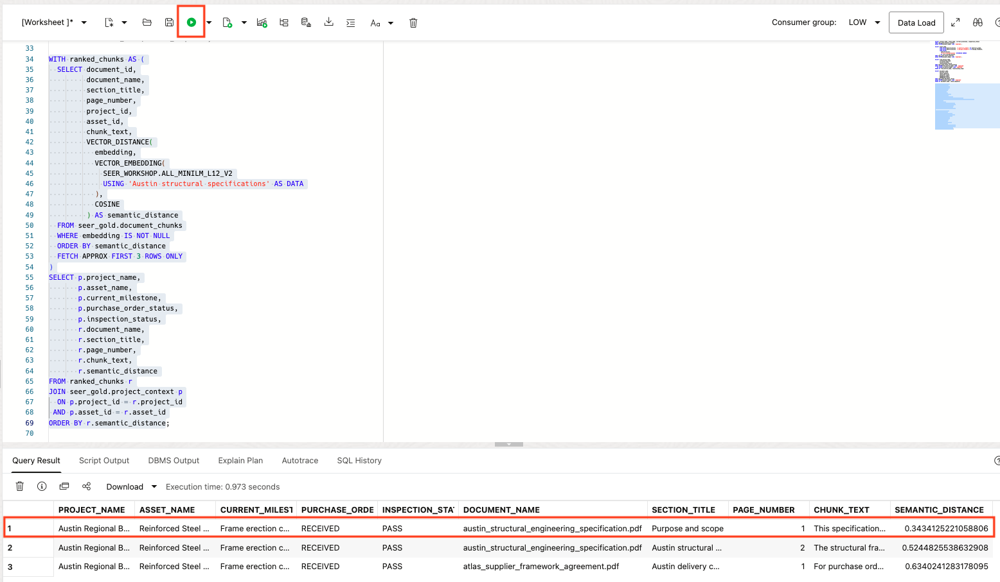

2. Review the results. Confirm that an Austin engineering-specification section ranks near the top, even if the chunk does not repeat the exact phrase Austin structural specifications.

3. Record the document name, section title, page number, and semantic distance for the best result. You will use the document name later to verify provenance.

4. Compare semantic retrieval with a simple keyword filter:

    ```sql
    <copy>
    SELECT document_name, section_title, page_number, chunk_text
    FROM seer_gold.document_chunks
    WHERE UPPER(chunk_text) LIKE '%AUSTIN STRUCTURAL SPECIFICATIONS%';
    </copy>
    ```

    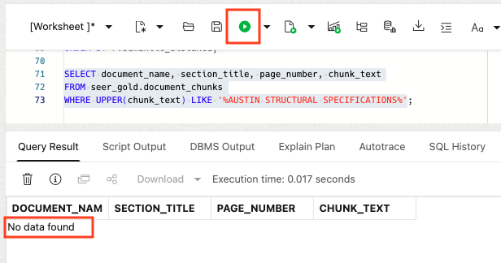

  5. Compare the results. Semantic search finds related meaning; keyword search finds an exact phrase. Production retrieval can combine both approaches when exact project codes, contract terms, or other literal phrases matter.

## Task 5: Combine document evidence with structured context

AI applications need more than a relevant document passage. They also need the project and asset context needed to interpret that passage and support a decision. The following query repeats the semantic ranking, selects the top three document chunks, and joins each result to the corresponding Gold project and asset context.

1. In the SQL Worksheet, run:

    ```sql
    <copy>
    WITH ranked_chunks AS (
      SELECT document_id,
             document_name,
             section_title,
             page_number,
             project_id,
             asset_id,
             chunk_text,
             VECTOR_DISTANCE(
               embedding,
               VECTOR_EMBEDDING(
                 SEER_WORKSHOP.ALL_MINILM_L12_V2
                 USING 'Austin structural specifications' AS DATA
               ),
               COSINE
             ) AS semantic_distance
      FROM seer_gold.document_chunks
      WHERE embedding IS NOT NULL
      ORDER BY semantic_distance
      FETCH APPROX FIRST 3 ROWS ONLY
    )
    SELECT p.project_name,
           p.asset_name,
           p.current_milestone,
           p.purchase_order_status,
           p.inspection_status,
           r.document_name,
           r.section_title,
           r.page_number,
           r.chunk_text,
           r.semantic_distance
    FROM ranked_chunks r
    JOIN seer_gold.project_context p
      ON p.project_id = r.project_id
     AND p.asset_id = r.asset_id
    ORDER BY r.semantic_distance;
    </copy>
    ```
    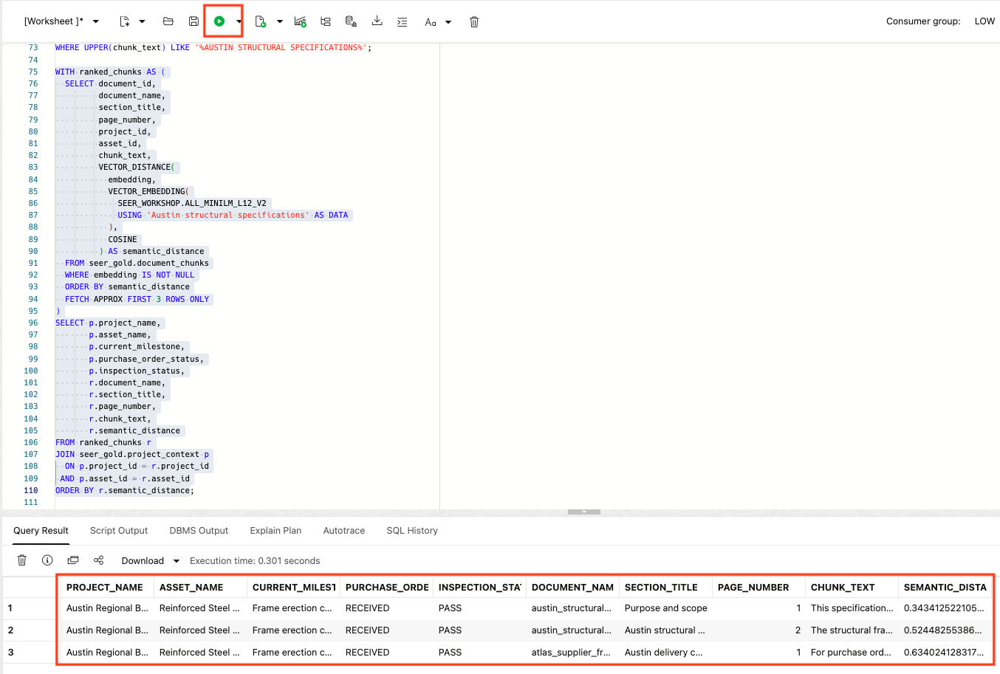

2. Review the results. Each row combines:

    * structured project context: milestone, purchasing, and inspection status;
    * engineering evidence: the matched document, section, page, and text;
    * retrieval context: semantic distance.

    This is an AI-ready retrieval pattern: an application can present a business answer alongside the document evidence that supports it.

3. Verify the provenance of one selected document. Replace the placeholder below with the document name returned by your semantic-search result, then run the query:

    ```sql
    <copy>
    SELECT document_name,
           object_uri,
           object_version,
           source_modified_at,
           extracted_at,
           chunking_policy,
           embedding_model,
           classification
    FROM seer_gold.document_provenance
    WHERE document_name = '<document name returned by your search>';
    </copy>
    ```

    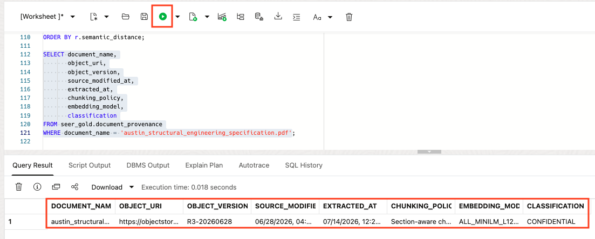

  4. Confirm that the document evidence can be traced to a specific Object Storage object and version. Review its extraction time, chunking policy, embedding model, and classification. Provenance allows an application or reviewer to verify where retrieved evidence came from, which version was used, and how it was prepared.

## Lab 2 Recap

In this lab, you:

* Inspected the Gold consumer-ready data sets that applications and agents can consume directly.
* Compared relational facts, JSON attributes, and relationship projections without creating separate copies of governed data.
* Reviewed how documents are registered, chunked, enriched with metadata, embedded, and indexed.
* Retrieved Austin engineering evidence by semantic meaning and compared it with keyword retrieval.
* Combined retrieved document evidence with Gold project context.
* Verified that the retrieved evidence can be traced to a governed Object Storage object and version.

The key takeaway: AI applications can retrieve trusted document evidence and ground it in business context without separating sensitive project material from its governance, quality controls, and provenance.

## Labs 1–2 Wrap-Up: From Governed Data to AI-Ready Context

In Labs 1 and 2, you followed the path from enterprise source data to trusted context for an AI application.
In Lab 1, you linked raw source data in Object Storage, preserved it as Bronze evidence, standardized it into Silver-style business entities, and examined Gold consumer-ready data sets designed for consumers. You also saw how quality rules, quarantine, and lineage make those consumer-ready data sets trustworthy.
In Lab 2, you extended that foundation with governed document evidence. You reviewed how documents are cataloged, chunked, enriched with metadata, embedded, and searched by meaning. You then combined retrieved engineering evidence with Gold project context and traced the result back to its source object and version.
The result is an AI-ready data foundation:

    `Enterprise sources and documents` → `governed Bronze evidence` → `standardized Silver entities` → `Gold business consumer-ready data sets and searchable document context` → `applications and agents with explainable answers`

### Data Transforms: Productionizing the Pattern

In this workshop, you used Data Studio and SQL to make each step visible. For example, you linked a Bronze external table, created a standardized supplier view, and queried prepared document chunks and vector-search results.
In production, **ALH Data Transforms** can package these same patterns into reusable visual data flows and workflows. A flow can define sources, mappings, expressions, validations, and target writes. A workflow can schedule and monitor those flows, manage dependencies, and record operational outcomes.

    `Source extracts and documents` → `Data Transforms or SQL pipelines` → `Bronze, Silver, and Gold outputs` → `quality checks, quarantine, lineage, and monitoring` → `trusted products for applications and agents`

Use SQL when a rule is concise and easy to express directly. Use Data Transforms when a team needs a visual, repeatable, scheduled, and monitored pipeline. Many production implementations use both.

### Optional Take-Home: Lab 3

Lab 3 is an optional readiness review. It examines the operational and governance evidence behind a consumer-ready data sets: pipeline runs, quality and freshness checks, published contracts, consumer mappings, and the final AI-readiness assessment. Its key question is: “Is this Gold consumer-ready data set not only useful, but safe and reliable to hand to developers and AI agents?”

## Learn More

- [Discover and Manage Data with Catalog in Autonomous AI Database](https://docs.oracle.com/en-us/iaas/autonomous-database-serverless/doc/catalog-entities.html)
- [Oracle AI Vector Search User's Guide](https://docs.oracle.com/en/database/oracle/oracle-database/26/vecse/)
- [Generate vector embeddings in Oracle Database](https://docs.oracle.com/en/database/oracle/oracle-database/26/vecse/generate-vector-embeddings.html)
- [JSON in Oracle Database](https://docs.oracle.com/en/database/oracle/oracle-database/26/adjsn/)

## Acknowledgements

- **Author:** Eli Schilling, Cloud Architect || Evangelist
- **Contributors:** Oracle LiveLabs and ONA Lab Experience Teams
- **Last Updated By / Date:** ONA Lab Experience team, July 2026
